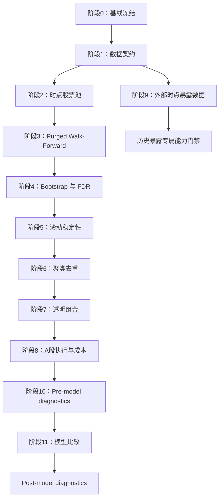

# Qlib A股因子研究框架详细实施路线图 V1

> 文档状态：执行版路线图<br>
> 制定日期：2026-07-12<br>
> 上位总纲：[Qlib A股因子研究框架完整升级计划 V1](./Qlib%20A股因子研究框架完整升级计划%20V1.md)<br>
> 收尾增补：[V1.1 门禁、Profile 与 Lineage 硬化计划](./FACTOR_VALIDATION_HARDENING_V1_1.md)<br>
> 模型前强制增补：[Selection Holdout Integrity 与后续模型计划 V1](./SELECTION_HOLDOUT_INTEGRITY_AND_MODEL_PLAN_V1.md)<br>
> 适用仓库：`E:\qlib_prj\qlib_baseline`

> 2026-07-13 执行说明：涉及阶段 5 eligibility、阶段 8 reference execution、阶段 10/11 诊断门禁、Profile 和 artifact lineage 时，以 V1.1 增补计划为准。

## 1. 文档目的

本路线图把升级总纲中的阶段 0—11 转换为可逐项执行、验证和提交的工作包。总纲负责定义目标、原则和最终 Definition of Done；本文件负责回答：

1. 先做什么、后做什么；
2. 每一步读取哪些既有输入；
3. 预计新增或修改哪些文件；
4. 产出哪些 compact artifacts；
5. 用什么测试和 contract 判定完成；
6. 失败或阻塞时停在哪里，哪些默认行为必须保持不变。

本路线图不是对现有 `factor_evaluation_v4`、batch runner、screening 或 judgement 的替代设计。所有新能力均作为现有链路的下游模块接入。

## 2. 当前起点与待核实事实

以下内容来自 2026-07-12 时仓库顶层文档和 compact outputs，只作为阶段 0 的审计起点，不能代替阶段 0 新生成的冻结快照：

| 项目 | 当前记录 | 阶段 0 动作 |
| --- | ---: | --- |
| runnable factors | 669 | 从 catalog、readiness 输出重新统计并交叉校验 |
| new-source runnable factors | 499 | 按 source family 重新统计 |
| multi-source screening rows | 679 | 校验主键唯一性和角色枚举 |
| multi-source judgement rows | 679 | 校验 research candidate、probe、holdout 数量 |
| research candidates | 342 | 冻结名单哈希，不改变默认角色 |
| new-source alpha probes | 328 | 只作为研究队列，不作为组合默认输入 |
| V3.39 residualized coverage min | 0.1495 | 复核计算来源并记录 blocked 原因 |
| V3.39 required coverage min | 0.80 | 不为过门禁而降低阈值 |
| V3.39 downstream default included | 0 | 必须保持为 0 |
| readiness 表述 | 旧文档有 `ready`，最新记录有 `research_blocked` | 以重跑后的 contract 为唯一当前结论并同步文档 |

阶段 0 之前不得把上述数字视为新的正式 baseline，也不得据此修改 candidate pool。

## 3. 执行约定

### 3.1 工作包状态

每个工作包只使用以下状态：

```text
pending       尚未开始
in_progress   正在实施
pass          代码、测试、contract 和文档均通过
warning       可继续，但风险已记录且不影响正确性
blocked       前置数据或外部能力不足，不得进入依赖该能力的阶段
fail          实现或正确性不满足要求，必须修复
```

计划文档中的任务默认都是 `pending`。实际推进时，在阶段报告和 `contract_status.csv` 中记录状态，不在本路线图里维护瞬时运行状态。

### 3.2 统一命名

沿用仓库现有风格：

```text
模块：       <domain>/<feature>.py
配置：       configs/<feature>_v1.yaml
运行器：     scripts/run_<feature>_v1.py
轻量验证：   scripts/validate_<feature>_v1.py
完整审计：   scripts/audit_<feature>_v1.py
输出：       outputs/<feature>_v1/<profile>/
报告：       <feature>_report.md
```

输出目录中的 `runtime/`、大型 frame、模型文件和 bootstrap 明细不进入 Git。Git 保存配置、manifest、compact summary、contract、audit report 和少量样例。

### 3.3 Profile 分层

每个新增阶段至少提供两类 profile：

| Profile | 用途 | 数据规模 | 是否进入 CI |
| --- | --- | --- | --- |
| `synthetic_smoke` | 合成数据正确性与边界测试 | 极小 | 是 |
| `local_smoke` | 少量真实交易日/因子集成验证 | 小 | 否 |
| `local_reference` | reference implementation 与接口验证 | 小 | 否 |
| `full_research` | 完整本地研究 | 大 | 否 |

配置继承应通过显式 YAML 字段或生成脚本完成，不在 Python 中隐藏覆盖参数。每次运行都保存 resolved config 或配置哈希。

V1.1 起另设规范字段 `profile_type: smoke | reference | full_research`。旧 Profile 名称只作为 `profile_name`；目录名和 `profile_name` 均不能替代强校验。`reference_ready` 可受控消费 smoke/reference，但任何 full/core 门禁只能消费同一条 full-research lineage。

### 3.4 统一 contract 规则

每阶段的 contract 至少包含：

```text
check_name,status,observed_value,required_value,severity,reason
```

额外建议字段：

```text
stage_id,profile,run_id,checked_at,input_manifest_hash
```

判定规则：

- 任一 `severity=critical` 的 `fail` 或 `blocked`：阶段不得晋级；
- `warning`：必须在 audit report 中给出影响范围和后续动作；
- 阈值变化：单独提交配置变更与前后对比，不与算法代码混在一起；
- contract 生成逻辑必须由合成测试覆盖，不能只检查文件是否存在；
- 所有 stage runner 失败时返回非零退出码，audit runner 对 `blocked/fail` 返回非零退出码。

### 3.5 默认链路冻结

在阶段 10 完成并通过前，以下默认输入保持不变：

```text
outputs/factor_candidate_pool_alpha158_v1/full158/alpha158_alpha_candidates.csv
outputs/multi_source_screening_v1/current/
outputs/multi_source_judgement_v1/current/
```

新输出一律使用实验性 profile，不覆盖 `current/`，也不修改现有 candidate role。只有阶段门禁通过、对比报告完成且单独批准后，才能讨论 downstream default 切换。

## 4. 总体依赖与实施顺序



推荐严格按 PR 1—12 的顺序合并。阶段 9 的采集准备可以在阶段 2—8 期间持续积累快照，但其历史数据使用和中性化实现仍在 PR 10 独立验收。

| 里程碑 | 阶段 | 核心交付 | 强制前置 | 晋级后允许 |
| --- | --- | --- | --- | --- |
| M0 | 0 | 可复现 baseline snapshot | 无 | 开始新增基础设施 |
| M1 | 1 | 可执行 DataFrame contract | M0 | 新模块统一校验输入输出 |
| M2 | 2 | PIT 动态股票池 | M1 | 用动态池做 smoke，不做全量筛选 |
| M3 | 3 | 无标签重叠的时间切分 | M2 | 生成滚动窗口 |
| M4 | 4 | block bootstrap + FDR | M3 | 在窗口内做显著性门禁 |
| M5 | 5 | stability board + stable pool | M4 | 实验性下游使用 stable pool |
| M6 | 6 | cluster representatives | M5 | 组合层使用去重因子 |
| M7 | 7 | 透明 composite score | M6 | 进入真实约束回测 |
| M8 | 8 | A股执行、成本和容量 contract | M7 | 统一执行口径比较组合 |
| M9 | 9 | 行业/市值 PIT 数据 contract | M1 | 合法中性化和暴露诊断 |
| M10 | 10 | 五种非模型方法的 pre-model 公平对比与压力测试 | M8 | 形成 core model 的诊断前置；历史暴露保持独立能力 |
| M11 | 11 | 简单模型与 ML 公平比较及 post-model diagnostics | M10、full/core gate | 仅在独立 PR 获准后训练并比较复杂模型 |

## 5. 阶段 0：现状冻结与兼容性审计

### 5.1 进入条件

- 只读现有研究结果；
- 不更新依赖、不重跑全量因子、不改默认候选；
- 先保存 `git status --short`，明确用户已有改动和未跟踪文件。

### 5.2 工作包

| ID | 步骤 | 主要动作 | 完成证据 |
| --- | --- | --- | --- |
| S0.1 | 冻结范围 | 记录 commit、工作树状态、Python/Qlib/provider 路径、数据目录修改时间；生成 `run_context.json` | manifest 可追溯到代码、环境和数据 |
| S0.2 | 资产清单 | 扫描总纲列出的 baseline、V4、batch、screening、judgement、OOS、readiness、V3.39 输出；记录路径、大小、mtime、SHA256、Git tracked 状态 | `baseline_artifact_manifest.csv` 无关键缺项 |
| S0.3 | 指标快照 | 从 compact CSV 提取 runnable、screening、judgement、candidate、probe、recent OOS 和 V3.39 coverage；为每个值记录来源文件与列名 | `baseline_metric_snapshot.csv` 可由脚本重复生成 |
| S0.4 | 状态统一 | 重跑 toolchain readiness 和 V3.39 audit；解决 `ready` 与 `research_blocked` 的文档冲突；区分“基础工具链 ready”和“研究下游 blocked” | `baseline_contract_status.csv` 给出唯一当前状态 |
| S0.5 | 依赖探针 | 检查 Python、Qlib、pandas、numpy、scipy、scikit-learn、statsmodels、pandera、mlfinpy、Riskfolio-Lib；记录 installed/import/version/license/core-or-optional | `dependency_compatibility.csv` 每项有明确结论 |
| S0.6 | 依赖分层 | 生成核心与可选 requirements；只写兼容范围和必要版本，不执行全环境升级 | 两个 requirements 文件可独立解析 |
| S0.7 | 回归验证 | 运行现有轻量 validator、readiness audit；不运行新的策略优化；记录命令、退出码和耗时 | audit report 包含成功与失败的原始命令 |
| S0.8 | 冻结报告 | 汇总仓库状态、拟修改文件、依赖结果、分阶段顺序、风险、阶段 1 方案 | `baseline_audit_report.md` 完整覆盖六项要求 |

### 5.3 预计文件

```text
configs/factor_validation_baseline_v1.yaml
scripts/audit_factor_validation_baseline_v1.py
requirements-research-validation.txt
requirements-optional-portfolio.txt
outputs/factor_validation_baseline_v1/current/
    run_context.json
    baseline_artifact_manifest.csv
    baseline_metric_snapshot.csv
    dependency_compatibility.csv
    baseline_contract_status.csv
    baseline_audit_report.md
```

### 5.4 验证顺序

```powershell
$python = 'E:\anaconda_envs\qlib_env\python.exe'
& $python -m pip check
& $python scripts\validate_liquidity_residualized_factor_evaluation_v1.py
& $python scripts\audit_liquidity_residualized_factor_evaluation_v1.py --config configs\liquidity_residualized_factor_evaluation_v1.yaml
& $python scripts\audit_factor_research_toolchain_v1.py --config configs\factor_research_toolchain_readiness_v1.yaml
& $python scripts\audit_factor_validation_baseline_v1.py --config configs\factor_validation_baseline_v1.yaml
```

阶段报告必须逐条记录实际退出码；预期的 V3.39 `blocked` 不应伪装为命令成功，而应作为已知研究门禁被正确捕获。

### 5.5 阶段门禁

- baseline 核心文件全部存在且可读；
- snapshot 中每个指标都有 source path、source column 和提取时间；
- 基础工具链状态与 V3.39 下游状态分开记录；
- 核心环境无新增 import failure；
- 可选依赖缺失只产生明确 warning，不影响现有链路；
- 没有任何默认 candidate、股票池或 evaluator 输出被改写。

失败时停在阶段 0，只修复审计脚本或文档冲突，不进入阶段 1。

## 6. 阶段 1：DataFrame 契约与防泄漏基础设施

### 6.1 设计边界

- 使用 Pandera 定义 schema；
- schema 只验证或返回显式副本，不原地修改调用方 DataFrame；
- 先兼容既有 compact outputs，再要求新模块强制通过；
- 对历史输出的兼容例外必须按文件和字段登记，不能使用全局跳过。

### 6.2 工作包

| ID | 步骤 | 主要动作 | 完成证据 |
| --- | --- | --- | --- |
| S1.1 | Schema inventory | 盘点现有 frame 的索引、列名、dtype、时区、主键和角色枚举 | `schema_inventory.csv` |
| S1.2 | Factor Frame | 定义 `(datetime,instrument)` 唯一、数值有限、列名唯一、覆盖率合法；支持 wide frame | 正常样例通过，重复键/inf/重复列失败 |
| S1.3 | Label Frame | 强制 `feature_time < label_start_time <= label_end_time`，记录 horizon 与 execution lag metadata | 边界相等、倒序和缺失时间被拒绝 |
| S1.4 | Tradability Frame | 校验 buy/sell 布尔、score 范围、bucket 枚举；增加旧字段映射的显式 adapter | 非法枚举和数值范围被拒绝 |
| S1.5 | Universe Interval | 校验 selection/effective、start/end、同股票区间重叠和空洞策略 | 非法重叠和同日生效被拒绝 |
| S1.6 | Screening/Judgement | 校验 factor 唯一、role 枚举、coverage、missing rate、holdout/probe 下游标志 | holdout/probe 误晋级被拒绝 |
| S1.7 | Contract API | 提供薄入口：`validate_<frame>()`、错误表标准化、strict/warn 模式；不引入第二套 runner 框架 | 所有新 runner 使用同一错误格式 |
| S1.8 | 既有输出兼容审计 | 对 baseline、screening、judgement、V3.39 compact outputs 批量验证 | 每个文件为 pass 或有逐项例外 |
| S1.9 | CI smoke | 新建轻量 pytest 集合；覆盖 good/bad/unsorted/no-mutation cases | 本地 pytest 全绿 |

### 6.3 预计文件

```text
research_validation/__init__.py
research_validation/schemas.py
configs/research_data_contracts_v1.yaml
scripts/validate_research_data_contracts_v1.py
scripts/audit_research_data_contracts_v1.py
tests/test_output_schemas.py
tests/fixtures/research_validation/
outputs/research_data_contracts_v1/current/
```

如果阶段 0 发现已有可复用的 contract row builder，则直接复用；只有确认没有共享实现时，才增加最小 `research_validation/contracts.py`。

### 6.4 验证命令

```powershell
& $python -m pytest tests\test_output_schemas.py -q
& $python scripts\validate_research_data_contracts_v1.py --profile synthetic_smoke
& $python scripts\audit_research_data_contracts_v1.py --config configs\research_data_contracts_v1.yaml
```

### 6.5 阶段门禁

- synthetic bad cases 全部被预期规则拒绝；
- no-mutation 测试通过；
- 既有核心 compact outputs 全部 pass 或有精确兼容例外；
- 新 schema 可在不初始化 Qlib 大数据的情况下运行；
- `contract_status.csv` 无 critical fail。

## 7. 阶段 2：时点化动态股票池

### 7.1 配置先行

先冻结 `point_in_time_universe_v1.yaml` 的字段和默认值，再实现算法。至少包含：provider URI、market、calendar、回看期、最少有效日、上市年龄、top N/quantile、更新频率、selection lag、effective lag、退出规则和 output profile。

### 7.2 工作包

| ID | 步骤 | 主要动作 | 完成证据 |
| --- | --- | --- | --- |
| S2.1 | 交易日与上市区间 | 复用 Qlib calendar 和 instruments interval；统一股票代码、时区和闭区间语义 | calendar/instrument audit |
| S2.2 | 月度 selection dates | 从交易日历生成月末或配置化更新日，不从数据最后一行推断 | selection schedule 可复现 |
| S2.3 | 只读历史窗口 | 对每个 selection date 只查询 `<= t` 的 amount/volume/有效日；所有读取记录 max source date | `future_data_reference_count=0` |
| S2.4 | Eligibility | 应用当时已上市、最低上市年龄、最少有效交易日、A股范围；不使用未来退市信息 | synthetic IPO/delist tests |
| S2.5 | Ranking | 计算过去 250 日等配置窗口的流动性指标，稳定排序并显式处理并列 | 输入打乱结果不变 |
| S2.6 | Effective membership | 成员在 selection 后下一交易日生效；记录进入、退出和理由 | selection/effective 审计通过 |
| S2.7 | Interval writer | 把连续相同成员合并为 Qlib instruments 区间；禁止非法重叠 | interval contract 通过 |
| S2.8 | Qlib round-trip | 生成 instruments 文件后由 Qlib 重新加载，并与 snapshots 对齐 | load/pass 和 membership diff=0 |
| S2.9 | 增量不变性 | 截断未来数据生成旧月份结果，再加入未来数据重跑并比较旧月份 | 历史成员哈希不变 |
| S2.10 | 本地 smoke | 用少量月份和较小 N 运行真实 provider，输出报告，不重评全量因子 | local smoke contract pass |

### 7.3 预计文件

```text
universes/__init__.py
universes/point_in_time_universe.py
universes/interval_writer.py
universes/universe_audit.py
configs/point_in_time_universe_v1.yaml
configs/point_in_time_universe_smoke_v1.yaml
scripts/run_point_in_time_universe_v1.py
scripts/validate_point_in_time_universe_v1.py
scripts/audit_point_in_time_universe_v1.py
tests/test_point_in_time_universe.py
tests/test_no_future_leakage.py
outputs/point_in_time_universe_v1/<profile>/
```

### 7.4 阶段门禁

```text
point_in_time_audit = pass
future_data_reference_count = 0
invalid_interval_count = 0
same_selection_effective_date_count = 0
qlib_instruments_load = pass
historical_membership_mutation_count = 0
```

门禁通过前，只允许 synthetic/local smoke，不允许用新股票池重跑全部 669 个因子。

## 8. 阶段 3：Purged Walk-Forward 时间划分

### 8.1 决策顺序

先定义 date-level split manifest，再展开到股票行。不得把 `datetime × instrument` 的行直接输入普通 KFold。

### 8.2 工作包

| ID | 步骤 | 主要动作 | 完成证据 |
| --- | --- | --- | --- |
| S3.1 | Label metadata | 从 label frame/config 解析 horizon、execution lag、label start/end；拒绝缺失 metadata | 1日和20日标签元数据不同 |
| S3.2 | Window planner | 实现 rolling/expanding 的 train/validation/test 日期边界和 step；不足窗口明确失败 | deterministic manifest |
| S3.3 | Purge adapter | 参考 mlfinpy `ml_get_train_times` 的重叠区间语义，自主实现唯一交易日适配层；mlfinpy 不作为仓库依赖 | overlap=0 与语义对照测试 |
| S3.4 | Embargo | 在 test 边界后按交易日而非自然日 embargo；保存被排除日期及原因 | violation=0 |
| S3.5 | Row expansion | date split 完成后将同日全部 instrument 分配到同一 fold | cross-fold=0 |
| S3.6 | Manifest | 为每个 split 保存计划日期、实际日期、样本数、purged/embargo 数、配置哈希 | manifest 可审计 |
| S3.7 | Property tests | 覆盖输入打乱、重叠标签、不同 horizon、空窗口、最小样本和边界日期 | pytest pass |
| S3.8 | PIT universe integration | 仅取该窗口当时有效成员，验证 universe membership 与 split date 对齐 | 无静态池回填 |

### 8.3 预计文件

```text
research_validation/purged_split.py
configs/purged_walk_forward_v1.yaml
scripts/run_purged_walk_forward_v1.py
scripts/validate_purged_walk_forward_v1.py
scripts/audit_purged_walk_forward_v1.py
tests/test_purged_split.py
tests/test_no_future_leakage.py
outputs/purged_walk_forward_v1/<profile>/
```

### 8.4 阶段门禁

```text
train_test_label_overlap = 0
train_validation_label_overlap = 0
same_date_cross_fold_count = 0
embargo_violation_count = 0
universe_date_mismatch_count = 0
split_contract = pass
```

任何 split 样本不足都应 `blocked`，不得自动缩短 label horizon、embargo 或 minimum dates。

## 9. 阶段 4：Block Bootstrap 与多重检验控制

### 9.1 统计口径冻结

在代码实现前，先在配置与报告中明确：统计序列、原假设、单双侧检验、block 类型、block length、bootstrap 次数、seed、FDR 方法、alpha 和 test family 定义。不同设置属于不同 `preprocessing_variant`，不得混用结果。

### 9.2 工作包

| ID | 步骤 | 主要动作 | 完成证据 |
| --- | --- | --- | --- |
| S4.1 | Series adapter | 从现有 V4 metric/runtime 输出提取 daily IC、Rank IC、long-short return；对齐 factor、date、window、horizon | series manifest |
| S4.2 | Block bootstrap | 优先调用兼容成熟实现；薄封装固定 seed、block length 和缺失处理；不把日样本当独立 | 自相关 synthetic test |
| S4.3 | Raw tests | 计算 statistic、SE、CI、raw p-value，记录有效天数和失败原因 | 每个结果可重现 |
| S4.4 | Test family builder | 按 source × horizon × window × preprocessing 构建 family；空 family 和缺字段失败 | missing family=0 |
| S4.5 | FDR | 使用 statsmodels `multipletests` 生成 BH/BY q-value 和 pass；NaN 不晋级 | 排序不变性测试 |
| S4.6 | Null simulation | 批量随机因子验证 false discovery rate；配置稳定信号验证 power | synthetic report |
| S4.7 | Runtime policy | bootstrap 明细写入 ignored runtime；Git 只保留汇总、seed 和 manifest | repo 无大明细 |
| S4.8 | Audit | 校验所有 selected factor 都有合法 q-value、family 和样本数 | contract pass |

### 9.3 预计文件

```text
research_validation/bootstrap.py
research_validation/multiple_testing.py
configs/factor_multiple_testing_v1.yaml
scripts/run_factor_multiple_testing_v1.py
scripts/validate_factor_multiple_testing_v1.py
scripts/audit_factor_multiple_testing_v1.py
tests/test_multiple_testing.py
outputs/factor_multiple_testing_v1/<profile>/
```

### 9.4 阶段门禁

```text
all_selected_factors_have_q_value = true
missing_test_family_count = 0
nan_p_value_promoted_count = 0
seed_reproduction_mismatch_count = 0
null_simulation_false_discovery_rate <= configured_limit
multiple_testing_contract = pass
```

## 10. 阶段 5：滚动评价与稳定性看板

### 10.1 防止 test 参与选择

选择函数的输入类型只允许 train/validation metrics。test evaluator 在因子方向、阈值和角色冻结后单独调用。审计输出必须记录 selection input columns，并检查任何列名或 lineage 中是否出现 test。

### 10.2 工作包

| ID | 步骤 | 主要动作 | 完成证据 |
| --- | --- | --- | --- |
| S5.1 | Split orchestrator | 逐 split 读取 PIT universe、data_quality、tradability，并调用既有 V4 runner | 每窗口 input manifest |
| S5.2 | Metric reuse | 优先消费 V4 metric index；只有缺少 daily series 时才补算，避免重复大型 frame | reuse/recompute 标志 |
| S5.3 | Train/validation selection | 配置化方向、coverage、turnover、FDR 和一致性规则；输出选中原因 | selection history |
| S5.4 | Freeze decision | 每窗口冻结 factor direction、预处理参数和角色；保存决策哈希 | freeze manifest |
| S5.5 | Test evaluation | 使用冻结决策评估 test，不把结果回写选择规则 | leakage audit pass |
| S5.6 | Stability metrics | 生成总纲规定的 window count、frequency、direction、OOS degradation、turnover、FDR、coverage | stability board |
| S5.7 | Role assignment | 配置化生成 stable_core、conditional_signal、risk_control、monitor、reject、holdout | 每个角色有 reason code |
| S5.8 | Stable pool | 输出实验性 stable pool 和 lineage，旧 candidate pool 保留不变 | downstream_default_changed=false |
| S5.9 | Resume support | 窗口级 checkpoint；配置或输入哈希变化时只失效相关窗口 | 中断恢复测试 |

### 10.3 预计文件

```text
research_validation/rolling_evaluation.py
research_validation/stability.py
configs/factor_rolling_stability_v1.yaml
scripts/run_factor_rolling_stability_v1.py
scripts/validate_factor_rolling_stability_v1.py
scripts/audit_factor_rolling_stability_v1.py
tests/test_rolling_evaluation.py
tests/test_no_future_leakage.py
outputs/factor_rolling_stability_v1/<profile>/
```

### 10.4 阶段门禁

```text
test_metrics_used_in_selection = false
unfrozen_test_evaluation_count = 0
all_selected_factors_have_multiple_windows = true
all_selected_factors_have_fdr_result = true
all_roles_have_reason_code = true
existing_candidate_pool_changed = false
stability_contract = pass
```

## 11. 阶段 6：因子相关性聚类与代表选择

### 11.1 输入范围

默认只对 `stable_core`、符合规则的 `conditional_signal` 和合法 `risk_control` 建图。holdout、reject、未通过 FDR 的普通研究因子不参与默认代表选择，但可在附录诊断中展示。

### 11.2 工作包

| ID | 步骤 | 主要动作 | 完成证据 |
| --- | --- | --- | --- |
| S6.1 | Exposure similarity | 每日截面 Spearman，再跨日稳健汇总；记录共同覆盖日期和样本数 | exposure matrix |
| S6.2 | Performance similarity | 对 daily IC 或 long-short return 时间序列计算相关；缺失重叠不足时标记不可比较 | performance matrix |
| S6.3 | Distance fusion | 配置化组合两种距离；保证对称、对角为零、有限值和 factor 顺序稳定 | matrix contract |
| S6.4 | Clustering backend | 先审计 Riskfolio-Lib；兼容则薄适配，否则使用 SciPy linkage，不自写算法 | backend/version manifest |
| S6.5 | Cluster cut | 在 train/validation 历史上选择阈值；test 不参与 cluster 数或阈值选择 | selection lineage |
| S6.6 | Representative scoring | 按稳定性、频率、FDR、换手、coverage、流动性暴露、可解释性逐级排序 | score breakdown |
| S6.7 | Cluster stability | 比较相邻窗口 cluster/representative 变化，标记不稳定簇 | cluster stability |
| S6.8 | Deduplicated pool | 每簇默认一票；risk_control 另行标记，不伪装 alpha | duplicate votes=0 |

### 11.3 预计文件

```text
factor_research/factor_similarity.py
factor_research/factor_clustering.py
factor_research/representative_selection.py
configs/factor_clustering_v1.yaml
scripts/run_factor_clustering_v1.py
scripts/validate_factor_clustering_v1.py
scripts/audit_factor_clustering_v1.py
tests/test_factor_clustering.py
outputs/factor_clustering_v1/<profile>/
```

### 11.4 阶段门禁

```text
distance_matrix_invalid_count = 0
every_selected_factor_has_cluster = true
every_cluster_has_representative = true
test_metrics_used_for_cluster_selection = false
default_combination_duplicate_cluster_votes = 0
clustering_contract = pass
```

## 12. 阶段 7：透明的多因子组合基线

### 12.1 固定对照组

`equal_directional_zscore` 必须作为所有组合的第一个对照。任何新增方法都使用相同因子输入、日期、缺失政策和 score clipping，差异只来自权重规则。

### 12.2 工作包

| ID | 步骤 | 主要动作 | 完成证据 |
| --- | --- | --- | --- |
| S7.1 | Component contract | 读取 cluster representative、冻结方向和当日因子值；校验最少组件数 | component diagnostics |
| S7.2 | Daily preprocessing | 用当日截面 winsorize/zscore/clip；参数只使用当时可用数据 | future reference=0 |
| S7.3 | Equal baseline | 实现 equal directional z-score，复现小样例手算结果 | golden test |
| S7.4 | Cluster equal | 每簇总权重相等，簇内只使用代表或配置允许的等权成员 | double count=0 |
| S7.5 | Stability weight | 只使用历史 selection frequency、agreement、FDR、OOS 稳定性、turnover 和 redundancy penalty | weight lineage |
| S7.6 | Missing policy | 明确单日缺失、最低组件数、重归一化和 score unavailable 行为 | edge-case tests |
| S7.7 | Weight constraints | 应用单因子/单簇上限，检查权重和、方向与 clip | diagnostics pass |
| S7.8 | Regularized linear 子阶段 | 在透明基线通过后才增加 Ridge/Elastic Net；仍使用 purged split | 单独配置与比较 |

### 12.3 预计文件

```text
portfolio/__init__.py
portfolio/score_construction.py
configs/factor_score_construction_v1.yaml
scripts/run_factor_score_construction_v1.py
scripts/validate_factor_score_construction_v1.py
scripts/audit_factor_score_construction_v1.py
tests/test_score_construction.py
tests/test_no_future_leakage.py
outputs/factor_score_construction_v1/<profile>/
```

`composite_scores.parquet` 和逐日组件明细默认放在 ignored runtime；Git 保存方法 manifest、窗口权重、compact diagnostics 和报告。

### 12.4 阶段门禁

```text
future_weight_reference_count = 0
same_cluster_double_counting = 0
weight_sum_error <= tolerance
direction_mismatch_count = 0
minimum_component_policy_pass = true
score_construction_contract = pass
```

## 13. 阶段 8：A股交易约束、成本和容量

### 13.1 实现顺序

先定义订单—成交—持仓—现金会计契约，再接 Qlib Exchange。不要先写收益汇总再补成交规则。

### 13.2 工作包

| ID | 步骤 | 主要动作 | 完成证据 |
| --- | --- | --- | --- |
| S8.1 | Assumption manifest | 冻结信号时点、执行时点、价格字段、T+1、lot size、费用、涨跌停、停牌、参与率 | execution assumptions |
| S8.2 | Order intent | composite score 转目标持仓和订单；先卖后买/资金预留规则显式化 | intents 可手工核对 |
| S8.3 | Exchange adapter | 复用 Qlib Exchange，薄适配 can_buy/can_sell、停牌、volume、limit 状态 | adapter contract |
| S8.4 | Lot & partial fill | 100 股整手、参与率上限和部分成交；记录剩余订单处理策略 | synthetic fills pass |
| S8.5 | Fee model | 分离买入成本、卖出成本、卖出税、最低佣金；固定 bps 保留为对照 | fee golden cases |
| S8.6 | Liquidity cost | base + volatility + participation + inverse liquidity；所有输入为执行前可得 | future price=0 |
| S8.7 | T+1 & blocked positions | 当日新买不可卖，涨跌停/停牌阻断后持仓延续 | position lifecycle tests |
| S8.8 | Accounting | 每日校验 cash、position、NAV、fees、unfilled order 守恒 | conservation error within tolerance |
| S8.9 | Capacity | 按资金规模输出 order value、daily amount、participation、impact 和 capacity multiple | capacity diagnostics |
| S8.10 | Qlib round-trip | 与简单无约束场景对照；解释差异来自费用或成交限制 | reconciliation report |

### 13.3 预计文件

```text
portfolio/portfolio_constraints.py
portfolio/execution_assumptions.py
portfolio/cost_model.py
portfolio/capacity.py
configs/a_share_execution_v1.yaml
scripts/run_a_share_execution_v1.py
scripts/validate_a_share_execution_v1.py
scripts/audit_a_share_execution_v1.py
tests/test_portfolio_accounting.py
tests/test_trade_constraints.py
outputs/a_share_execution_v1/<profile>/
```

### 13.4 合成测试执行顺序

1. 无约束、零费用的单股票手算场景；
2. 101 股整手处理；
3. 最低佣金和买卖税费方向；
4. 涨停不可买、跌停不可卖、停牌不交易；
5. 参与率导致部分成交；
6. T+1 与阻断持仓延续；
7. 多日现金和持仓守恒；
8. 禁止未来价格成交。

### 13.5 阶段门禁

```text
cash_conservation_error <= tolerance
position_conservation_error <= tolerance
invalid_trade_count = 0
future_price_execution_count = 0
t_plus_one_violation_count = 0
fee_direction_error_count = 0
execution_contract = pass
```

## 14. 阶段 9：行业与市值时点数据接入

### 14.1 双轨策略

本阶段分为“向前快照采集”和“合法历史数据研究”两条轨道。向前采集可尽早启动；只有能证明发布日期/effective date 的数据才进入历史研究。

### 14.2 工作包

| ID | 步骤 | 主要动作 | 完成证据 |
| --- | --- | --- | --- |
| S9.1 | Source inventory | 记录 AKShare 及候选来源的字段、接口、许可、频率、历史能力和失败策略 | data source inventory |
| S9.2 | Raw snapshot | 原样保存响应、采集时间、请求参数、source URL/接口名、内容哈希和 snapshot ID | raw manifest 可追溯 |
| S9.3 | PIT field model | 映射 instrument、record/announcement/effective dates、有效区间和 valid flag | schema pass |
| S9.4 | No-backfill rule | 当前快照禁止填历史；缺 announcement/effective date 时只允许 forward use | backfill count=0 |
| S9.5 | Interval resolution | 处理行业变更、财报更新和重述；明确 effective_to 和冲突优先级 | interval audit |
| S9.6 | Coverage | 按日期、股票池、字段、来源统计 coverage 和 stale age | coverage board |
| S9.7 | Neutralization | contract 通过后才实现 raw/liquidity/size/industry-size 并列版本，不覆盖 raw | suffix/lineage tests |
| S9.8 | Failure isolation | 网络失败、字段变更和限频不影响核心研究环境；缓存原始快照供重放 | offline replay test |

### 14.3 预计文件

```text
data_adapters/__init__.py
data_adapters/akshare_snapshot.py
data_adapters/point_in_time_fields.py
configs/external_exposure_data_v1.yaml
scripts/run_external_exposure_snapshot_v1.py
scripts/build_point_in_time_exposure_fields_v1.py
scripts/validate_external_exposure_data_v1.py
scripts/audit_external_exposure_data_v1.py
tests/test_point_in_time_fields.py
tests/test_no_future_leakage.py
outputs/external_exposure_data_v1/current/
```

### 14.4 阶段门禁

```text
historical_current_snapshot_backfill_count = 0
missing_effective_date_count = 0  # 对进入历史研究的记录
invalid_interval_count = 0
untraceable_source_count = 0
raw_factor_overwrite_count = 0
point_in_time_exposure_contract = pass
```

若只能获得当前快照，本阶段可将“向前采集”判为 pass，但“历史中性化”必须保持 blocked；历史暴露专属诊断和整个 V1 最终 DoD 同步 blocked。该状态不再阻塞 V1.1 的 core pre-model diagnostics，只阻塞 `historical_exposure_model_ready`。

## 15. 阶段 10：最终组合诊断与压力测试

### 15.1 公平比较矩阵

所有方法共享同一 run manifest：动态股票池、walk-forward split、label、execution lag、交易约束、成本、基准、资金、调仓频率。方法专属配置仅允许因子选择与权重方式不同。V1.1 将本阶段拆成模型前后两层：本阶段先完成不依赖训练的 `pre_model_diagnostics`；模型产出只进入后续 `post_model_diagnostics`。

### 15.2 工作包

| ID | 步骤 | 主要动作 | 完成证据 |
| --- | --- | --- | --- |
| S10.1 | Baseline adapters | 统一接入 Alpha158 等权、旧 candidate 等权、stable 等权、cluster equal、stability weight；不得要求 regularized/model output | method manifest |
| S10.2 | Common execution | 所有方法复用阶段 8 的订单、费用和容量模型 | execution hash 相同 |
| S10.3 | Rolling results | 按 test window 生成净收益、IR、回撤、换手、win ratio、worst window 和 degradation | rolling performance |
| S10.4 | Cost/capacity | 运行 5/10/20/30 bps 与流动性成本、多个资金规模 | sensitivity tables |
| S10.5 | Portfolio grid | 比较 TopK、调仓周期、流动性阈值和股票池规模；网格预先配置 | no post-hoc hidden scan |
| S10.6 | Ablation | 剔除最强单因子与最强簇，检查收益集中度 | ablation results |
| S10.7 | Regime | 预先定义熊市、震荡、高波动区间，禁止按结果挑日期 | regime manifest |
| S10.8 | Exposure | 输出 factor/cluster/liquidity/industry/size 暴露；缺 PIT 数据时仅将历史暴露能力标记 blocked | exposure diagnostics |
| S10.9 | Promotion rule | 多指标规则决定 research candidate，不按单一最高收益 | decision board |
| S10.10 | Freeze | 冻结最终研究候选、参数、输入哈希；声明仍非实盘信号 | final manifest |
| S10.11 | Common period | 同时输出 native/common-period；公共日期上重新计算全部排名指标 | alignment violation=0 |
| S10.12 | Diagnostic split | pre-model contract 不读取模型，post-model 只建立后续入口 | gate DAG cycle=0 |

### 15.3 预计文件

```text
portfolio/final_diagnostics.py
configs/final_portfolio_diagnostics_v1.yaml
scripts/run_final_portfolio_diagnostics_v1.py
scripts/validate_final_portfolio_diagnostics_v1.py
scripts/audit_final_portfolio_diagnostics_v1.py
tests/test_method_comparison_contract.py
outputs/final_portfolio_diagnostics_v1/<profile>/
```

### 15.4 阶段门禁

- 所有方法 common run fields 完全一致；
- pre-model required methods 只包含五种非训练方法；
- 方法排名只读取 common-period，公共日期完全一致；
- 多数 OOS 窗口为正，且最差窗口在配置阈值内；
- 较高成本场景下未明显失效；
- 换手和容量未越过门禁；
- 单因子/单簇 ablation 后不是完全失效；
- 流动性依赖不过度集中；
- test 只用于最终冻结评价；
- `pre_model_diagnostics_contract = pass`；历史行业/市值缺失可保持 capability-specific blocked。

## 16. 阶段 11：机器学习模型比较

### 16.1 开始条件

只有 `core_model_ready=true` 才能在后续独立 PR 开始 core model 训练。该能力要求同一条 full-research lineage 上的 PIT universe、purged split、multiple testing、stability、clustering、score construction、正式 execution 和 pre-model diagnostics 全部通过。历史行业/市值只限制历史暴露模型，V3.39 只限制流动性残差化模型；二者不再作为所有 core model 的全局前置。

### 16.2 工作包

| ID | 步骤 | 主要动作 | 完成证据 |
| --- | --- | --- | --- |
| S11.1 | Feature allowlist | 只允许 stable_core、合格 conditional、cluster representatives、risk_control | rejected feature audit |
| S11.2 | Equal/Stability baselines | 固定简单基线结果和运行哈希 | baseline manifest |
| S11.3 | Ridge | 同一 purged split，train/validation 调参，test 隔离 | window model params |
| S11.4 | Elastic Net | 同口径比较稀疏性、稳定性、换手和净表现 | comparison table |
| S11.5 | LightGBM | 仅在线性模型完成后加入；限制复杂度并保存特征重要性 | model lineage |
| S11.6 | Hyperparameter audit | 记录每次候选、validation 得分和最终选择；test 不在搜索表 | leakage=0 |
| S11.7 | Importance stability | 跨窗口比较 feature/cluster importance 和集中度 | importance board |
| S11.8 | Promotion | 只有多窗口净改善、成本可控、重要性不集中才晋级 | promotion decision |

### 16.3 预计文件

```text
portfolio/model_comparison.py
configs/factor_model_comparison_v1.yaml
scripts/run_factor_model_comparison_v1.py
scripts/validate_factor_model_comparison_v1.py
scripts/audit_factor_model_comparison_v1.py
tests/test_model_selection_leakage.py
outputs/factor_model_comparison_v1/<profile>/
```

### 16.4 阶段门禁

```text
disallowed_feature_count = 0
test_hyperparameter_reference_count = 0
all_windows_have_model_manifest = true
importance_cluster_concentration <= configured_limit
net_oos_improvement_vs_simple_baseline > configured_minimum
model_comparison_contract = pass
```

复杂模型未达门禁时不是项目失败；结论应是保留简单透明组合为默认研究方案。

## 17. 测试与 CI 落地顺序

### 17.1 第一批：阶段 1 随 PR 2 建立

```text
tests/test_output_schemas.py
tests/test_config_parsing.py
tests/test_imports.py
```

### 17.2 后续按阶段追加

```text
PR 3   test_point_in_time_universe.py, test_no_future_leakage.py
PR 4   test_purged_split.py
PR 5   test_multiple_testing.py
PR 6   test_rolling_evaluation.py
PR 7   test_factor_clustering.py
PR 8   test_score_construction.py
PR 9   test_portfolio_accounting.py, test_trade_constraints.py
PR 10  test_point_in_time_fields.py
PR 11  test_method_comparison_contract.py
PR 12  test_model_selection_leakage.py
```

CI 只运行不依赖完整 Qlib provider 和网络的测试。需要真实数据的测试统一加 `local_data` marker，并由本地验证命令运行。所有 multiprocessing runner 均包含 Windows `freeze_support()` 入口保护。

## 18. 每个 PR 的固定交付清单

每个阶段提交前逐项确认：

- [ ] 单一阶段、单一职责，没有顺手重构无关模块；
- [ ] 配置含默认值、注释、schema/version 和 output profile；
- [ ] runner 支持 `--config`，必要时支持 `--profile`/`--dry-run`；
- [ ] synthetic test 覆盖正常、异常、输入打乱和防泄漏；
- [ ] local smoke 结果有 manifest、contract 和 compact report；
- [ ] 大文件进入 `tmp/` 或 `outputs/*/runtime/` 并由 `.gitignore` 管理；
- [ ] audit 对 critical blocked/fail 返回非零；
- [ ] README、`docs/DOC_INDEX.md` 和项目上下文按需更新；
- [ ] 现有 baseline、candidate pool 和默认配置未被覆盖；
- [ ] 许可证和新增依赖已记录；
- [ ] PowerShell/Windows 路径和 multiprocessing 已验证；
- [ ] PR 描述包含运行命令、耗时、已知 warning 和回退方式。

## 19. 风险登记与处理顺序

| 风险 | 早期信号 | 处理 | 禁止动作 |
| --- | --- | --- | --- |
| V3.39 低覆盖 | residualized coverage 仍远低于 0.80 | 阶段 0 定位 source/universe/time overlap；保持 downstream=0 | 降阈值过门禁 |
| readiness 语义冲突 | 同一版本同时出现 ready/research_blocked | 拆分 toolchain readiness 与 downstream research gate | 只改文案不重跑 audit |
| mlfinpy 环境要求 | Python/NumPy 约束与已验证环境冲突 | 不安装该包；只参考 MIT 语义并用合成标签区间验证自主实现 | 为安装单包升级或降级整个环境 |
| Riskfolio-Lib 冲突 | 依赖解析影响 Qlib 环境 | 保持 optional，回退 SciPy | 重建整个 Qlib 环境 |
| PIT 外部数据不足 | 只有当前快照、无 effective date | 只做向前采集，历史研究 blocked | 当前值回填历史 |
| 计算量失控 | 669 因子 × 多窗口 × bootstrap 产生巨量输出 | manifest 驱动、窗口 checkpoint、复用 V4 metric index、runtime ignored | 一次性全量重跑后再补审计 |
| test 泄漏 | selection 表出现 test 字段或 test lineage | API 隔离、列白名单、leakage audit | 人工口头保证 |
| 交易会计错误 | cash/position 不守恒 | 先手算 synthetic，再接 Qlib Exchange | 只看收益曲线 |
| 用户已有改动被覆盖 | 工作树非 clean | 阶段开始记录 status，只改本阶段文件 | reset/checkout 用户改动 |

## 20. 当前实际推进顺序

阶段 0—4 的基础实现和阶段 5—10 的 reference implementation 已形成。2026-07-13 起，后续推进顺序由 V1.1 收尾计划接管：

1. 冻结门禁循环、Profile 混用、稳定性覆盖率、方法日历和 lineage 基线；
2. 建立 Profile 与 artifact lineage 基础契约；
3. 为 PIT universe 至 model gate 的关键阶段接入 manifest；
4. 修复稳定性 eligibility 与角色规则；
5. 修复 reference execution 会计和日历语义；
6. 拆分 pre/post-model diagnostics 并生成 common-period 比较；
7. 拆分 reference/full/core/可选能力门禁；
8. 重跑轻量测试、reference audit、CI，并更新草稿 PR。

完整任务编号、禁止项和结束条件见 [V1.1 门禁、Profile 与 Lineage 硬化计划](./FACTOR_VALIDATION_HARDENING_V1_1.md)。本轮仍不启动模型训练、不执行 669 因子全量运行、不接入新因子源和 Qlib Exchange。

## 21. 整体完成判定

总纲中的 16 条 Definition of Done 继续作为最终标准。本路线图额外要求：

1. 每条最终标准都能追溯到一个 stage contract check；
2. 每个最终候选能追溯到 source、factor formula、PIT universe、split、FDR family、cluster、weight、order 和 fill；
3. 任意完整研究 run 可由 config、manifest、commit、provider snapshot 和 random seed 重建；
4. 没有通过门禁的实验输出不会被 `current/` 或默认配置误用；
5. 如果简单组合优于复杂模型，最终结论明确保留简单组合，不把“使用 ML”本身当作完成标准。

## 22. PR #4.1 Selection Holdout Integrity 与后续模型顺序

本节是 2026-07-20 PR #4 合并后审计形成的强制修订，优先级高于第 16 节以及第 20 节中与当前阶段冲突的表述。详细字段、目录、配置、测试矩阵和提交拆分以 [Selection Holdout Integrity 与后续模型计划 V1](./SELECTION_HOLDOUT_INTEGRITY_AND_MODEL_PLAN_V1.md) 为唯一执行清单。

2026-07-21 起，本轮获准在门禁通过后执行大规模因子计算。每次扩容前仍必须完成全仓审阅、受限 canary、mutation/validator 和 run-specific review bundle。默认交由用户核对 exact commit/config/input/command/scope；本次持续对话可使用已明确授予的 `user_session_waiver`，无需再次等待。当前路线全部完成后，先把下一阶段详细计划提交到文档，再开始后续实现。

本次持续对话另有计算推进授权：用户明确允许 review bundle 完成后无需再次等待人工审阅即可计算。授权覆盖当前 PR #4.1，并可延伸到“前一阶段验收完成后、先落实到文件并提交”的后续计划内计算；不豁免 hard-stop、全仓自审、canary、mutation、validator、资源检查和 exact approval artifact，也不覆盖尚未形成文档的新范围、实盘或未来独立对话。

### 22.1 审计结论与当前门禁

PR #4 的因子目录、30 分区矩阵、批处理恢复、daily IC、purged outer split 和 Qlib Exchange 工程证据保留。当前 16 个代表不得继续称为 frozen model allowlist，原因如下：

1. stability role 使用 outer-test IC、test coverage 和 test-vs-validation degradation；
2. clustering 对 exposure 与 daily IC 使用完整日期范围；
3. stability 虽声明 FDR artifact 为上游，却内部重新 bootstrap/FDR；
4. raw market cache 和外部因子源码没有完整进入矩阵 input hash 与直接 lineage。

量化复核显示，外部 FDR 与 stability 内部 FDR 的 2,007 个 q-value 全部不同，112 个 BH pass 标记不同；仅反转 test IC 即可使 `stable_core` 从 65 个变为 1 个。治理结论必须是 blocked；当前 Draft GitHub PR #5 已修改生成器、validator 和模型入口，机器状态已与以下目标一致：

```text
feature_allowlist_frozen = false
feature_selection_holdout_clean = false
clustering_holdout_clean = false
fdr_artifact_consumed = false
raw_input_provenance_complete = false
core_model_ready = false
pr5_model_training_ready = false
model_training_started = false
selection_integrity_status = blocked
```

### 22.2 PR #4.1 工作包

| 包 | 内容 | 必需结果 |
| --- | --- | --- |
| A | 机器级撤回 readiness，登记历史探索输出 | 当前 16 因子 `model_input_allowed=false`；readiness=false/blocked；模型 loader 非零拒绝 |
| B | raw/provider/source provenance、cache key v3 与执行放行 | 先提交 canary/review bundle；exact user approval 或有效 session waiver 后才允许 30 批重跑及 cache-hit 复跑 |
| C | development robustness windows | 每个 outer split 至少 3 个 purged inner windows；outer test overlap=0；不宣称严格 nested selection replay |
| D | split-scoped FDR 数据流 | 3 个独立 family × 669 hypotheses；Stability 逐行消费上游 artifact，禁止内部重算 |
| E | train/validation-only stability | API 不接收任何 `test_*` 选择字段；test 只进入冻结后的 OOS diagnostics |
| F | date-bounded clustering 与 allowlist | 三个 split 各自按精确 development dates 生成 allowlist，不创建跨历史 test 的全局名单 |
| G | split-specific score 与执行 | 方向、权重、score 均按 split 冻结，再用相同 Qlib Exchange 执行 |
| H | anti-leakage 与 lineage 验证 | 修改 test IC/exposure/labels/OHLCVA/row order/缺失不改变 development 与选择 payload hashes |
| I | pre-test freeze | 每个 split 冻结 allowlist、预处理/权重或模型、配置、数据和代码 hashes 后才允许 test release |

统计语义修复不能为通过门禁而降低 FDR、IC、稳定性、覆盖率或最小组件阈值。因旧矩阵缺少完整 generation provenance，`raw_input_provenance_complete=true` 必须建立在 cache key v3 的一次 30 批受控重跑上；事后证明和 `legacy_provenance_attested` 只能用于开发对照。

### 22.3 PR #4.1 完成条件

全部满足后方可打开 PR #5：

- 三个 FDR family 各有 669 个唯一假设，test date consumption=0；
- FDR→Stability receipts 的 missing、extra、q-value mismatch 均为 0；
- 三个 split-specific allowlists 都只引用自己的 development evidence；
- clustering exposure 与 performance dates 都等于允许日期集合；
- test mutation 不改变任何选择或权重 artifact hash；
- 大批量运行的 review bundle 已推送，用户 approval 与实际 commit/config/input/command/scope 完全匹配；
- 每个 split 的 `pre_test_freeze_manifest.json` 在首次 test read 前生成并通过 hash 校验；
- raw/provider/source provenance 完整且 cache key v3 生效；
- split-specific transparent score、Qlib execution、accounting 和 lineage contract 通过；
- 测试、validator、PR CI、合并后 main CI 全部通过；
- `model_training_started=false`。

### 22.4 PR #5A—#5D

| PR | 范围 | 开始条件 | 禁止项 |
| --- | --- | --- | --- |
| #5A | Equal Weight、Stability Weight、共同输入/预处理/prediction schema | PR #4.1 全部门禁通过 | Ridge、Elastic Net、LightGBM |
| #5B | Ridge 后 Elastic Net；validation 选参，train+validation final refit，split-specific test 一次评价 | #5A protocol 与透明基线通过 | test 调参、改变 allowlist |
| #5C | 预注册最多 16 个 LightGBM candidates、固定 seed、validation early stopping、development final refit | #5B 三个 split 全部通过且用户批准搜索 | test early stopping、test feature selection |
| #5D | 五种方法相同 common period 和 Qlib execution 的历史 OOS 科学比较 | #5C contract 通过 | 将历史 winner 直接声明为生产模型 |
| #6 | 新未来数据 / forward paper confirmation | #5D 完成且候选、窗口、配置预注册 | 根据 forward 表现中途调参或切换候选 |

PR #5 的统一顺序固定为：

```text
Equal Weight → Stability Weight → Ridge → Elastic Net → LightGBM
```

每个方法都必须保存 split model/prediction manifest、超参数或权重、prediction artifact、execution summary、contract 和完整 lineage。模型只使用该 outer split 的 frozen allowlist。PR #5A 统一冻结 `mean_daily_rank_ic` 主指标以及 ICIR、coverage、complexity、config hash tie-break；搜索阶段 preprocessing 只在 outer train fit，outer validation 用于选择；选定后在 outer train+validation 重新 fit preprocessing/final model，再生成 pre-test freeze，outer test 只评价一次。PR #5D 只能完成 `historical_oos_comparison_complete=true`，必须保持 `production_model_selected=false`；最终可以得出“透明基线优于机器学习”的科研结论，不强制晋级复杂模型。

### 22.5 当前立即执行顺序

```text
同一 Draft PR 先实施机器级 hard-stop
→ 补齐 provenance 与 cache key v3
→ 受限 canary + bulk-run review bundle
→ review bundle 自审 + exact approval/session waiver
→ 30 批受控重跑和 cache-hit 复跑
→ development robustness windows + outer-split FDR gate
→ train/validation-only stability
→ split-specific clustering/allowlists
→ 扩展 test mutation
→ transparent score + pre-test freeze + Qlib execution
→ lineage/CI
→ 合并 PR #4.1 并在 main 复验
→ 才能创建 PR #5A
```

Approval/waiver 只覆盖完全一致的 commit、resolved config、input inventory、exact command、日期、因子数和资源范围；任一变化都必须重新审查。默认没有用户明确回复时停止；本次持续对话可在完整自审通过后使用已授权的 exact `user_session_waiver` 继续。
