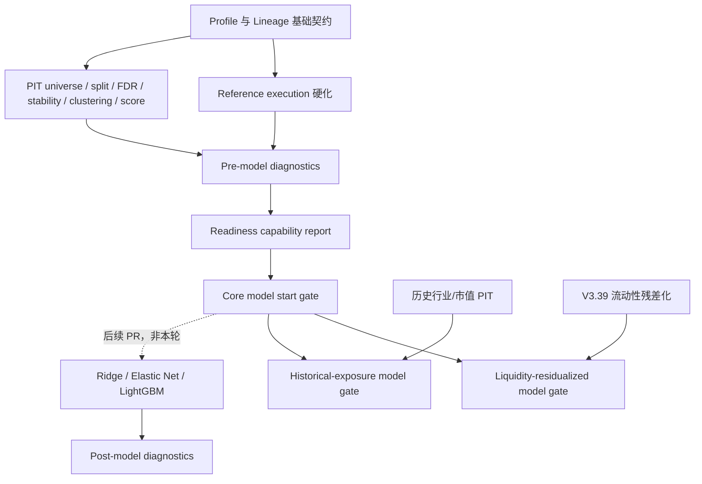

# Qlib A股因子验证框架 V1.1 门禁、Profile 与 Lineage 硬化计划

> ARCHIVED / HISTORICAL：本阶段已完成且部分结论已被后续审计取代。

> 文档状态：实施完成，等待 PR CI 最终确认<br>
> 制定日期：2026-07-13<br>
> 适用分支：`agent/factor-validation-roadmap-v1`<br>
> 适用 PR：草稿 PR #1<br>
> 上位总纲：[Qlib A股因子研究框架完整升级计划 V1](./Qlib%20A股因子研究框架完整升级计划%20V1.md)<br>
> 原始路线图：[Qlib A股因子研究框架详细实施路线图 V1](./FACTOR_VALIDATION_ROADMAP_V1.md)

> **V1.1.1 审计更正（2026-07-13）：** V1.1 的基础设施实现仍有效，但后续复核确认新版 stability 已全部 holdout，而活动 clustering、score、execution 与 diagnostics 曾保留并消费旧成功产物。因此本文件中的 `reference_ready=true` 仅是被审计推翻的历史结论。该问题已由 [REFERENCE_PIPELINE_CONSISTENCY_V1_1_1.md](./REFERENCE_PIPELINE_CONSISTENCY_V1_1_1.md) 修复；当前状态为 `reference_infrastructure_ready=true`、`reference_pipeline_ready=false`、兼容字段 `reference_ready=false`。

## 1. 任务定位

本计划是 V1 路线图的收尾硬化增量，不是新的因子研究阶段。它修复当前 reference implementation 中的门禁循环、Profile 语义漂移、稳定性低覆盖误晋级、不同执行日期直接比较以及端到端 lineage 缺失问题。

本计划对 V1 中以下内容具有优先解释权：

- 阶段 5 的窗口 eligibility、稳定性指标和角色规则；
- 阶段 8 的 reference execution 会计与日历边界；
- 阶段 10 的 pre-model / post-model diagnostics 边界；
- 阶段 11 的能力门禁和模型启动条件；
- 所有关键阶段的 Profile 与 artifact lineage 规则。

本轮必须保持以下硬边界：

```text
不启动 Ridge、Elastic Net、LightGBM 或其他模型训练
不执行 669 因子全量运行
不接入新的因子源
不把 AKShare 当前快照回填为历史数据
不在本 PR 接入 Qlib Exchange
不修改现有默认 candidate pool 或实盘语义
```

## 2. 本轮结束时的目标状态

本轮不是为了把所有门禁变绿，而是让每个绿灯和阻塞都具有准确语义。预期状态固定为：

| 能力 | 预期 | 含义 |
| --- | --- | --- |
| `reference_ready` | `true`（V1.1 历史目标，已废止） | 该结论已被 V1.1.1 一致性审计推翻；当前兼容字段为 `false` |
| `full_research_ready` | `false` | 尚无全链路、同 Profile、完整 lineage 的 full-research 产物 |
| `core_model_ready` | `false` | 尚未满足正式执行与 full-research 核心门禁 |
| `liquidity_residualized_model_ready` | `false` | V3.39 coverage contract 仍为 `0.1495 < 0.80` |
| `historical_exposure_model_ready` | `false` | 真实历史行业/市值 PIT 数据仍不可用 |
| `model_training_started` | `false` | 本轮禁止训练 |

本节的 `reference_ready=true` 仅保留为 V1.1 修复前历史目标，不是当前状态。当前为 `reference_infrastructure_ready=true`、`reference_pipeline_ready=false`、`reference_ready=false`。`blocked` 是有效、可验收的结果，不得通过降低阈值、伪造 lineage 或混用 Profile 消除。

### 2.1 实施结果（2026-07-13）

以下是 V1.1 当时记录、后来被 V1.1.1 审计推翻的历史 readiness，不得作为当前门禁证据：

```text
reference_ready = true
full_research_ready = false
core_model_ready = false
liquidity_residualized_model_ready = false
historical_exposure_model_ready = false
model_training_started = false
lineage_status = reference_only
```

关键验收结果：

- 诊断门禁已拆为 `pre_model_diagnostics` / `post_model_diagnostics`；pre 层只要求五种非训练方法，不再依赖 `regularized_linear` 或 `lightgbm`。
- native-period 保留 821/486 日差异；common-period 五种方法统一使用 2022-01-06—2024-01-05 的 486 个交易日，排名兼容入口指向 common-period 表。
- 稳定性门禁加入日期数、coverage 和有效 IC 数联合 eligibility；旧 reference 输入的 10 个因子全部降为 `holdout`，不再出现 7.4% coverage 的 `stable_core`。
- execution 不再按零价估值缺行情持仓；本次 reference 重跑披露 2,203 次持仓行情缺失、230,394,300 股未成交量，现金最小值保持非负，日历明确为 `signal_date_only`。
- 九类关键阶段均输出统一 artifact manifest；历史 clustering/score 产物明确为 `reference_only`，模型门禁可追溯 8 个上游 artifact，不伪造 full lineage。
- AKShare 历史行业/市值缺口只阻塞 `historical_exposure_model_ready`；`mlfinpy` 只作语义参考，不升级 Python，也不进入仓库依赖。
- 仓库轻量测试为 60 passed；`pytest.ini` 将发现范围限定到 `tests/`，避免误收集 `tmp/reference_repos` 的第三方测试。

本轮未训练模型、未运行 669 因子全量任务、未回填 AKShare 历史快照、未接入 Qlib Exchange。下一 PR 边界仍为 Qlib Exchange integration。

## 3. 当前实现基线审计

审计基于 2026-07-13 的分支 `agent/factor-validation-roadmap-v1`，基线提交为 `b276269`。以下六项均已由配置、代码和 compact outputs 复核。

| ID | 审计结论 | 当前证据 | V1.1 处理 |
| --- | --- | --- | --- |
| A1 | 阶段 10/11 存在循环门禁 | `final_portfolio_diagnostics_v1.yaml` 把 `regularized_linear` 列为 required；`factor_model_comparison_v1.yaml` 又要求 final diagnostics 先通过 | 拆分 `pre_model_diagnostics` 与 `post_model_diagnostics` |
| A2 | 当前模型 gate 混用 Profile | PIT 来自 `local_smoke`，多个阶段来自 `local_reference`，purged split 目录名为 `full_research`，外部暴露来自 `current` | 增加规范化 `profile_type`、兼容矩阵和强校验 |
| A3 | 当前稳定性输入不是新 PIT full-research 评价 | `factor_rolling_stability_v1.yaml` 与 `factor_multiple_testing_v1.yaml` 均读取 `factor_evaluation_v4/liquid2000_open_source_eval` | 现有结果只认定为 reference；full gate 禁止消费该输入 |
| A4 | 方法比较日期不一致 | `alpha158_equal`、`old_candidate_equal` 各 821 日（2020-10-12—2024-02-27）；其余三种方法各 486 日（2022-01-06—2024-01-05）；公共日期 486 日，差异日期 335 日 | 同时输出 native-period 与 common-period，排名只读 common-period |
| A5 | 低 coverage 可误入 `stable_core` | 当前 4 个 `stable_core` 的 `coverage_min` 均为 `0.074074`；runner 在通过绝对日期数后直接写入 `eligible=True` | eligibility 同时校验日期数、覆盖率和有效 IC 数；角色规则强制消费 coverage |
| A6 | 外部 PIT 被错误升级为全局模型阻塞 | 当前模型 gate 单列 `external_exposure`，final diagnostics 也因历史暴露 blocked，导致所有模型被阻塞 | 外部历史暴露只阻塞 `historical_exposure_model_ready`，不单独阻塞 core gate |

补充审计发现：

- 当前 9 个模型前置 contract 为 7 pass、2 blocked；blocked 来源是 `external_exposure` 和 `final_diagnostics`。
- 现有关键输出只有 split manifest 或局部 method manifest，不具备统一 artifact manifest，无法证明 universe、split、catalog、frame 和日期范围属于同一条链。
- `execution_engine.py` 使用 `close_prices.get(instrument, 0.0)` 估值缺行情持仓，买入可承受数量未预留交易费用，NAV 只覆盖 signal 驱动的执行日期。
- `positive_ic_window_ratio` 直接判断原始 test IC 是否为正，会把冻结方向为负但方向正确的因子记为失败。
- `maximum_oos_degradation` 当前实际保存 `abs(test_ic) - abs(validation_ic)` 的最小值，字段名称与“最差负值”的语义不一致。

上述审计结论是 V1.1 的冻结起点。实现过程中若发现数值变化，必须先生成差异说明，不能静默改写本节。

## 4. 目标依赖关系



关键约束：

- `pre_model_diagnostics` 不读取任何训练模型产物；
- `post_model_diagnostics` 只能在模型产物已存在后运行；
- core model 的未来训练入口只依赖 `core_model_ready`；
- 流动性残差化模型和历史暴露模型分别消费自己的附加能力门禁；
- 本轮所有训练入口保持关闭，目标只是让依赖图无环且报告真实。

## 5. Profile 规范

### 5.1 规范字段

所有关键配置和输出必须同时记录：

```yaml
profile_name: local_reference       # 人类可读的具体运行名称
profile_type: reference             # smoke | reference | full_research
```

旧字段 `profile` 在一个兼容周期内可保留，但必须与 `profile_name` 相同；不允许仅通过目录名推断 `profile_type`。

### 5.2 旧名称映射

| 旧名称 | 规范 `profile_type` | 说明 |
| --- | --- | --- |
| `synthetic_smoke` | `smoke` | 合成边界测试 |
| `local_smoke` | `smoke` | 少量真实数据集成测试 |
| `local_reference` | `reference` | reference implementation |
| `current` | 必须显式声明 | 不能从名称猜测；当前外部快照应声明 `reference` |
| `full_research` | `full_research` | 只有完整上游和 lineage 校验通过后才合法 |
| `gated` | 非数据 Profile | 改为 `profile_name: gated_reference` 并显式声明 `profile_type: reference` |

现有 `outputs/purged_walk_forward_v1/full_research/` 不能仅凭目录名获得 full-research 资格。若其上游 universe、factor frame 或 lineage 不完整，应在 V1.1 迁移时重新生成到 reference 目录，或标记 `lineage_status=reference_only` 并阻止 full gate 消费。

### 5.3 Profile 兼容规则

| 消费门禁 | 可接受输入 | 结果语义 |
| --- | --- | --- |
| 模块 smoke contract | `smoke` | 只证明合成/小数据边界正确 |
| `reference_ready` | `smoke` 与 `reference`，允许受控混合 | 必须报告 `profile_mix_status=reference_only`，不能晋级 |
| `full_research_ready` | 全部为 `full_research` | 任一 smoke/reference 输入立即 blocked |
| `core_model_ready` | 全部为 `full_research` 且 lineage 完整 | 不接受目录名伪装或 reference fallback |
| 模型产出比较 | 模型及基线均为同一 `full_research` 链 | 不允许跨 Profile 排名 |

只有 `reference_ready` 可为了兼容当前流水线消费 smoke/reference 混合输入；该例外必须显式输出，不能传递给任何可训练或可晋级门禁。

## 6. Artifact Lineage 规范

### 6.1 统一 manifest

以下阶段每次运行都必须输出 `artifact_manifest.json`：

```text
PIT universe
purged walk-forward
multiple testing
rolling stability
clustering
score construction
execution
pre-model diagnostics
post-model diagnostics
model gate
```

manifest 最少包含：

```text
schema_version
artifact_id
stage_id
run_id
profile_name
profile_type
lineage_status
config_sha256
code_commit_sha
code_dirty
universe_artifact_id
split_manifest_id
factor_catalog_id
factor_frame_id
input_artifact_ids
start_date
end_date
created_at
output_file_hashes
missing_lineage_fields
```

其中用户要求的字段全部为强制 schema 字段。阶段不适用的直接 lineage 字段可以为 `null`，但 gate 所需字段不得为 `null`。

### 6.2 标识与哈希规则

- `run_id`：一次执行的唯一 ID，建议为 UTC 时间戳加随机后缀；不得作为内容相等判断依据。
- `artifact_id`：对规范化 manifest 核心字段和 compact output SHA256 计算的稳定内容 ID；计算时排除 `artifact_id`、`created_at` 和 `run_id`，避免自引用。
- `config_sha256`：对 resolved config 的规范化 UTF-8 内容计算，不对原始 YAML 文本直接计算。
- `code_commit_sha`：运行时 Git commit；若工作树非 clean，同时记录 `code_dirty=true` 和 `code_diff_sha256`。full-research gate 默认拒绝 dirty run。
- `input_artifact_ids`：去重、排序后的直接上游 artifact ID；不得填写文件路径冒充 ID。
- `output_file_hashes`：只包含 Git 保留的 compact outputs 和必要 manifest；大型 runtime 文件由独立 frame ID/size/hash 元数据追踪。

### 6.3 Lineage 状态

```text
complete        所有本阶段必需 lineage 可追溯且一致
reference_only  reference 链可运行，但缺少 full-research 必需字段或混用 smoke/reference
incomplete      必需 lineage 缺失
inconsistent    上下游 ID、Profile 或日期范围冲突
```

不得为旧产物臆造上游 ID。迁移无法恢复真实 lineage 时，输出 `reference_only` 或 `incomplete`，并在 `missing_lineage_fields` 中逐项说明。

### 6.4 Gate 必查规则

1. 所有消费 universe 的产物必须具有相同 `universe_artifact_id`；
2. 所有窗口化产物必须具有相同 `split_manifest_id`；
3. FDR、稳定性、聚类、score 和模型输入的 `factor_catalog_id` / `factor_frame_id` 必须一致；
4. 下游日期范围必须被上游日期范围覆盖；
5. promotable gate 不得混用 smoke、reference、full-research；
6. 每个 `input_artifact_id` 必须能递归解析到上游 manifest；
7. artifact DAG 不得成环；
8. `lineage_status` 非 `complete` 时，full/core gate 必须 blocked。

## 7. 诊断门禁拆分

### 7.1 Pre-model diagnostics

只比较不需要训练的五种方法：

```text
alpha158_equal
old_candidate_equal
stable_equal
cluster_equal
stability_weight
```

规范方法 ID 使用 `stable_equal`。现有 `equal_directional_zscore` 作为一个兼容周期内的 source alias 保留，manifest 必须同时记录 `method_id=stable_equal` 和 `source_method=equal_directional_zscore`，避免 alias 被误计为第六种方法。

明确禁止把以下方法列为 pre-model required：

```text
regularized_linear
ridge
elastic_net
lightgbm
```

建议输出：

```text
outputs/pre_model_diagnostics_v1/<profile>/
    native_period_method_comparison.csv
    common_period_method_comparison.csv
    rolling_performance.csv
    regime_performance.csv
    cost_sensitivity.csv
    capacity_sensitivity.csv
    ablation_results.csv
    exposure_diagnostics.csv
    artifact_manifest.json
    contract_status.csv
    pre_model_diagnostics_report.md
```

### 7.2 Post-model diagnostics

只在未来模型 PR 中消费已经冻结的模型输出，并把模型与五个简单基线放在相同 common-period、执行和成本口径下比较。本轮只建立 schema、空入口或 blocked contract，不生成模型结果。

建议输出：

```text
outputs/post_model_diagnostics_v1/<profile>/
    common_period_model_comparison.csv
    model_incremental_diagnostics.csv
    artifact_manifest.json
    contract_status.csv
    post_model_diagnostics_report.md
```

### 7.3 循环消除验收

依赖图必须满足：

```text
pre_model_diagnostics -> core_model_ready -> model training -> post_model_diagnostics
```

任何配置或代码中出现以下反向依赖都视为 critical fail：

```text
pre_model_diagnostics requires regularized_linear
core_model_ready requires post_model_diagnostics
model training requires a diagnostic that requires the same model output
```

## 8. 能力门禁定义

### 8.1 门禁矩阵

| 前置能力 | `reference_ready` | `full_research_ready` | `core_model_ready` | `liquidity_residualized_model_ready` | `historical_exposure_model_ready` |
| --- | :---: | :---: | :---: | :---: | :---: |
| 模块 contract 通过 | 必需 | 必需 | 必需 | 必需 | 必需 |
| Profile 为 full-research | 否 | 必需 | 必需 | 必需 | 必需 |
| lineage 完整一致 | 可为 `reference_only` | 必需 | 必需 | 必需 | 必需 |
| PIT universe | smoke/reference 可接受 | full 必需 | full 必需 | full 必需 | full 必需 |
| Purged split / FDR / stability / clustering / score | reference 可接受 | full 必需 | full 必需 | full 必需 | full 必需 |
| Pre-model diagnostics | reference pass | full pass | full pass | full pass | full pass |
| 正式 Qlib Exchange execution | 否 | 按正式研究定义必需 | 必需 | 必需 | 必需 |
| V3.39 liquidity residualization | 否 | 否 | 否 | 必需 | 否 |
| 历史行业/市值 PIT | 否 | 否 | 否 | 否 | 必需 |

`full_research_ready` 表示核心研究链条已形成 full Profile，不代表所有可选数据能力都已具备。若项目把“正式执行”定义为 core 链的一部分，则在下一 PR 完成 Qlib Exchange 前保持 false。

### 8.2 未来模型启动规则

- core Ridge / Elastic Net / LightGBM：只在 `core_model_ready=true` 后允许；
- 使用流动性残差化特征的模型：额外要求 `liquidity_residualized_model_ready=true`；
- 使用行业/市值暴露或中性化的模型：额外要求 `historical_exposure_model_ready=true`；
- 本 V1.1 计划无论门禁结果如何都强制 `model_training_started=false`。

### 8.3 门禁报告字段

模型 gate 至少输出：

```text
reference_ready
full_research_ready
core_model_ready
liquidity_residualized_model_ready
historical_exposure_model_ready
model_training_started
blocking_capability
blocking_check
blocking_artifact_id
blocking_reason
```

每个 false 值必须能定位到具体 contract row 和 artifact ID；不得只写笼统的 `prerequisites blocked`。

## 9. 稳定性 eligibility 与角色规则

### 9.1 配置字段

`factor_rolling_stability_v1.yaml` 增加：

```yaml
minimum_train_dates: 40
minimum_validation_dates: 40
minimum_test_dates: 40
minimum_train_coverage: 0.80
minimum_validation_coverage: 0.80
minimum_test_coverage: 0.80
minimum_train_valid_ic_count: 40
minimum_validation_valid_ic_count: 40
minimum_test_valid_ic_count: 40
minimum_eligible_windows: 3
minimum_selection_frequency: 0.60
minimum_direction_agreement: 0.80
minimum_direction_adjusted_positive_window_ratio: 0.60
maximum_allowed_oos_degradation: 0.03
```

上述数值是 V1.1 初始 contract，不得为了保留当前四个 `stable_core` 而下调。若数据口径证明 coverage 分母有误，应先修正分母并输出前后审计，不直接改阈值。

### 9.2 窗口 eligibility

每个 train、validation、test fold 必须分别同时满足：

```text
actual_trading_dates >= minimum_*_dates
actual_trading_dates / expected_trading_dates >= minimum_*_coverage
valid_ic_count >= minimum_*_valid_ic_count
```

窗口不满足时仍保留一行审计记录，写入 `eligible=false` 和 reason code；不得通过 `continue` 让失败窗口从分母中消失，也不得无条件写入 `eligible=true`。

建议 reason code：

```text
insufficient_train_dates
insufficient_validation_dates
insufficient_test_dates
insufficient_train_coverage
insufficient_validation_coverage
insufficient_test_coverage
insufficient_train_valid_ic
insufficient_validation_valid_ic
insufficient_test_valid_ic
```

### 9.3 统计口径

- `eligible_window_count`：`eligible=true` 的窗口数；
- `selection_frequency`：eligible 窗口内 selected 窗口占比，不以所有计划窗口作分母；
- `direction_adjusted_positive_window_ratio`：eligible 窗口中 `test_mean_ic * frozen_direction > 0` 的比例；
- `positive_ic_window_ratio`：保留一个兼容周期但标记 deprecated，不再参与角色判断；
- `oos_degradation_delta = abs(test_mean_ic) - abs(validation_mean_ic)`；负值代表 OOS 恶化；
- `worst_oos_degradation = min(oos_degradation_delta)`；
- `maximum_allowed_oos_degradation` 是允许的最大恶化幅度正数，门禁条件为 `worst_oos_degradation >= -maximum_allowed_oos_degradation`。

### 9.4 `stable_core` 必要条件

`stable_core` 至少同时满足：

```text
eligible_window_count >= minimum_eligible_windows
coverage_min >= min(minimum_train_coverage, minimum_validation_coverage, minimum_test_coverage)
selection_frequency >= minimum_selection_frequency
direction_agreement_ratio >= minimum_direction_agreement
direction_adjusted_positive_window_ratio >= minimum_direction_adjusted_positive_window_ratio
worst_oos_degradation >= -maximum_allowed_oos_degradation
```

角色判断必须输出逐条件布尔列和 reason code。test 仍不得参与单窗口 train/validation 选择；方向调整后的 test 指标只用于冻结选择之后的稳定性角色评估。

## 10. Common-period 方法比较

### 10.1 双输出

最终诊断必须同时输出：

```text
native_period_method_comparison.csv
common_period_method_comparison.csv
```

- native-period：每种方法在自身全部有效日期上的诊断，只用于信息展示；
- common-period：取所有 required methods 的公共有效日期，重新计算收益、IR、回撤、换手和排名指标；模型晋级、方法排名和 promotion 只能读取该文件。

不得把 native summary 截取字段后直接当作 common summary；必须先按公共日期过滤 daily rows，再重新计算路径依赖指标。

### 10.2 日期 contract

至少输出：

```text
common_start_date
common_end_date
common_trading_days
method_date_mismatch_count
method_date_missing_cell_count
common_period_alignment_violation_count
ranking_input_period_type
```

定义：

- `method_date_mismatch_count`：原始方法日历并集内，并非所有 required methods 都有有效行的不同日期数；当前基线应为 335；
- `method_date_missing_cell_count`：方法 × 日期 availability matrix 中的缺失单元数；
- `common_period_alignment_violation_count`：生成 common-period 后，各方法日期集合与公共日期集合不一致的数量，必须为 0；
- `ranking_input_period_type`：必须为 `common_period`。

若 required method 缺失，pre-model diagnostics blocked；不得通过把缺失方法排除出交集来制造 pass。

## 11. Reference execution 硬化

本轮保留自定义 reference execution 的定位，不声称等价于 Qlib Exchange。正式执行接入明确留到下一 PR。

### 11.1 持仓估值

- 持仓缺少当日 close 时严禁使用 0；
- reference 模式可使用最后一个合法 close 估值，但必须记录 `valuation_price_source=stale_last_close`、stale days 和 `missing_valuation_count`；
- 没有任何历史合法价格时，当日 NAV 标记 invalid，full/core gate blocked；
- 合成测试必须证明缺行情不会令持仓价值瞬间归零。

### 11.2 买入可承受数量

买入数量必须满足：

```text
shares * execution_price + all_applicable_fees(shares) <= cash_available
shares % lot_size = 0
```

由于最低佣金导致费用函数非线性，使用整手递减或单调搜索求最大可承受数量。成交后现金必须 `>= -cash_tolerance`；超出 tolerance 立即 critical fail，不得靠截断现金为 0 掩盖。

### 11.3 日历模式

配置显式增加：

```yaml
calendar_mode: full_trading_calendar | signal_date_only
```

- reference smoke 可使用 `signal_date_only`，但 manifest 和报告必须显示该限制；
- 方法比较只允许同一 `calendar_mode`；
- full/core gate 要求 `full_trading_calendar`；
- full calendar 模式每个要求的交易日都要 mark-to-market，无调仓日也输出 NAV 行。

### 11.4 未成交与估值审计字段

每日或汇总输出至少增加：

```text
missing_valuation_count
stale_valuation_count
invalid_nav_count
unfilled_order_count
unfilled_share_count
negative_cash_count
calendar_mode
expected_trading_days
actual_nav_days
```

拒单、部分成交和零成交都要进入未成交统计，不得只记录 partial fills。

## 12. 逐步实施工作包

### 12.1 V11.0：冻结审计与契约决策

| ID | 动作 | 预计文件 | 完成证据 |
| --- | --- | --- | --- |
| V11.0.1 | 固化本节六项审计与基线数字 | 本文、`outputs/factor_validation_hardening_v1_1/reference/` | audit report 可重复生成 |
| V11.0.2 | 冻结 Profile 映射、能力矩阵和字段语义 | 本文、配置 schema | 无未定义名称 |
| V11.0.3 | 列出所有现有产物的 profile/lineage 缺口 | `artifact_migration_inventory.csv` | 每个关键阶段一行 |
| V11.0.4 | 确认禁止项和下一 PR 边界 | report、PR 描述 | training started=false |

### 12.2 V11.1：Profile 与 Lineage 基础设施

| ID | 动作 | 预计文件 | 完成证据 |
| --- | --- | --- | --- |
| V11.1.1 | 实现 Profile enum、旧名映射和兼容矩阵 | `research_validation/profiles.py` | 非法值与非法晋级被拒绝 |
| V11.1.2 | 实现 artifact manifest schema | `research_validation/lineage.py` | good/bad synthetic manifest tests |
| V11.1.3 | 实现 resolved config SHA、Git SHA/dirty 状态和 artifact ID | 同上 | 顺序不影响哈希，输入变化会变更 ID |
| V11.1.4 | 实现 DAG 解析、上游存在性和成环检查 | 同上 | missing/cycle/inconsistent tests |
| V11.1.5 | 为旧产物生成迁移清单，不伪造 lineage | migration script | 缺项为 `reference_only`/`incomplete` |

### 12.3 V11.2：关键阶段 Lineage 接入

按依赖顺序接入：PIT universe → purged split → multiple testing → rolling stability → clustering → score → execution → diagnostics → gate。

| ID | 动作 | 完成证据 |
| --- | --- | --- |
| V11.2.1 | 每个 runner 读取直接上游 manifest 并写自己的 manifest | 九类输出均有 `artifact_manifest.json` |
| V11.2.2 | 将 universe/split/catalog/frame ID 向下透传 | lineage consistency test pass |
| V11.2.3 | 校验日期包含关系和 Profile 兼容 | date/profile mismatch blocked |
| V11.2.4 | 当前 reference 链不能恢复的字段诚实标记 | `lineage_status=reference_only` |
| V11.2.5 | 更新 audit runner 输出具体 blocking artifact | blocked 原因可定位到 run ID |

本工作包只重跑现有小型 reference 资产，不执行 669 因子全量计算。

### 12.4 V11.3：稳定性硬化

| ID | 动作 | 完成证据 |
| --- | --- | --- |
| V11.3.1 | 增加 dates/coverage/valid-IC 配置与校验 | resolved config 保存全部阈值 |
| V11.3.2 | 不再丢弃失败窗口，输出 eligibility reason | 计划窗口行数保持完整 |
| V11.3.3 | selection/role 只使用各自允许的列 | leakage tests pass |
| V11.3.4 | 增加 direction-adjusted ratio | 负方向合成因子通过 |
| V11.3.5 | 重命名 worst degradation 并保留兼容迁移 | 新字段语义一致 |
| V11.3.6 | 角色规则纳入 coverage、eligible windows 和 worst OOS | 低 coverage 不得为 stable_core |
| V11.3.7 | 重跑 10 个 reference factor×horizon | 旧结论变化有差异报告 |

### 12.5 V11.4：Reference execution 硬化

| ID | 动作 | 完成证据 |
| --- | --- | --- |
| V11.4.1 | 移除零价格估值 fallback | missing quote synthetic test |
| V11.4.2 | 实现含费用的最大可承受整手数量 | min commission/cash boundary tests |
| V11.4.3 | 加入 negative cash critical contract | `negative_cash_count=0` |
| V11.4.4 | 显式 calendar mode 并输出日历覆盖 | calendar contract |
| V11.4.5 | 汇总拒单、部分成交和未成交 shares | unfilled outputs 完整 |
| V11.4.6 | 限制 reference execution 的 readiness 语义 | 不产生 formal execution pass |

### 12.6 V11.5：诊断拆分与共同日期

| ID | 动作 | 完成证据 |
| --- | --- | --- |
| V11.5.1 | 把当前 final diagnostics 重构为 pre-model diagnostics | required methods 正好为五种简单方法 |
| V11.5.2 | 建立 post-model schema/blocked 入口 | 不要求任何当前模型产物存在 |
| V11.5.3 | 输出 native/common 双表 | 两个文件均有明确 period type |
| V11.5.4 | 按公共日期重新计算全部路径指标 | common dates 完全一致 |
| V11.5.5 | 方法排名和 promotion API 只接受 common-period | native input 被拒绝 |
| V11.5.6 | 暴露诊断拆为核心与可选项 | 历史 exposure 不阻塞 pre-model core diagnostics |

### 12.7 V11.6：能力门禁与模型入口

| ID | 动作 | 完成证据 |
| --- | --- | --- |
| V11.6.1 | 实现五类 readiness 的独立判定 | 报告同时输出五个布尔值 |
| V11.6.2 | 删除 global external-exposure prerequisite | AKShare blocker 只出现在历史暴露能力 |
| V11.6.3 | full/core gate 强制 Profile 与 lineage | smoke/reference 均不能晋级 |
| V11.6.4 | 消除 regularized-linear 循环依赖 | DAG cycle count=0 |
| V11.6.5 | 保留训练硬开关 | `model_training_started=false` |
| V11.6.6 | 输出逐项 blocking lineage | 每个 false 有 artifact/check/reason |

### 12.8 V11.7：测试、CI、文档与 PR 收尾

| ID | 动作 | 完成证据 |
| --- | --- | --- |
| V11.7.1 | 保持现有 43 项测试通过 | regression pass |
| V11.7.2 | 新增本计划规定的轻量测试 | targeted pytest pass |
| V11.7.3 | CI 继续只跑轻量 contract tests | GitHub Actions pass |
| V11.7.4 | 重跑 reference artifacts 和 gate report | expected state 与第 2 节一致 |
| V11.7.5 | 同步总纲、路线图、索引、context 和 PR 描述 | 无过时 readiness 文案 |
| V11.7.6 | 检查 Git 范围和大型文件 | worktree clean，无 runtime 大文件入 Git |
| V11.7.7 | 明确下一 PR 为 Qlib Exchange integration | PR 描述和 Next Work 一致 |

## 13. 预计新增或修改文件

建议新增：

```text
research_validation/profiles.py
research_validation/lineage.py
portfolio/diagnostic_gates.py
configs/factor_validation_hardening_v1_1.yaml
configs/pre_model_diagnostics_v1.yaml
configs/post_model_diagnostics_v1.yaml
scripts/audit_factor_validation_hardening_v1_1.py
scripts/migrate_reference_artifact_lineage_v1_1.py
scripts/run_pre_model_diagnostics_v1.py
scripts/run_post_model_diagnostics_v1.py
tests/test_profile_gates.py
tests/test_artifact_lineage.py
tests/test_diagnostic_gate_cycle.py
tests/test_common_period_diagnostics.py
```

预计修改：

```text
configs/factor_model_comparison_v1.yaml
configs/factor_rolling_stability_v1.yaml
configs/factor_multiple_testing_v1.yaml
configs/final_portfolio_diagnostics_v1.yaml
portfolio/model_comparison.py
portfolio/final_diagnostics.py
portfolio/execution_engine.py
research_validation/rolling_evaluation.py
scripts/run_factor_rolling_stability_v1.py
scripts/run_final_portfolio_diagnostics_v1.py
scripts/run_factor_model_comparison_v1.py
各关键阶段 runner / audit runner
docs/DOC_INDEX.md
docs/PROJECT_CONTEXT_SUMMARY.md
```

允许通过兼容 wrapper 保留旧 `run_final_portfolio_diagnostics_v1.py`，但它必须清楚转发到 pre-model diagnostics，不能继续承担模型后诊断语义。

## 14. 最低测试矩阵

除现有 43 项测试外，至少新增以下测试：

| 测试 | 关键断言 |
| --- | --- |
| 循环门禁消除 | gate DAG 无环；pre 不依赖模型 |
| pre-model 不要求 regularized linear | 五种 required methods 可独立 pass |
| smoke 不能过 full gate | `full_research_ready=false` |
| reference 不能过 core gate | `core_model_ready=false` |
| lineage 不一致被阻断 | universe/split/frame 任一 ID 不同即 blocked |
| lineage 缺失不伪造 | 状态为 reference_only/incomplete |
| 低 coverage 不得 stable_core | `coverage_min=0.074` 合成输入被降级 |
| 负方向因子方向调整成功 | raw IC<0 但 frozen_direction=-1 时 adjusted ratio 为正 |
| worst degradation 语义 | 最负 delta 被保存，阈值比较方向正确 |
| common-period 日期一致 | 每种方法日期集合完全相同 |
| 排名拒绝 native-period | ranking API 抛出明确错误 |
| 缺失行情不按零估值 | NAV 不发生持仓归零 |
| 手续费后现金不为负 | 最低佣金边界仍满足 cash contract |
| 未成交统计完整 | reject/partial 都计入 unfilled |
| 不同执行日历不可比较 | method calendar mismatch blocked |
| 外部 PIT 只阻塞专属能力 | core blocker 列表不出现 AKShare 历史暴露 |

所有新测试必须使用合成或 compact fixture，不初始化全量 Qlib 数据，不进入 CI 的长任务范围。

## 15. 验证顺序

```powershell
$python = 'E:\anaconda_envs\qlib_env\python.exe'

& $python -m pytest tests\test_profile_gates.py tests\test_artifact_lineage.py -q
& $python -m pytest tests\test_rolling_evaluation.py tests\test_common_period_diagnostics.py -q
& $python -m pytest tests\test_a_share_execution.py tests\test_diagnostic_gate_cycle.py -q
& $python -m pytest tests -q

& $python scripts\audit_factor_validation_hardening_v1_1.py --config configs\factor_validation_hardening_v1_1.yaml
& $python scripts\run_factor_model_comparison_v1.py --config configs\factor_model_comparison_v1.yaml
```

最后一个模型 gate 命令在本轮可以按设计返回 blocked 非零码；验收脚本必须区分“预期 blocked”与代码失败，并核对六个 readiness 字段，不以 shell exit code 单独判断任务失败。

## 16. 提交顺序

建议按可独立回滚的提交推进：

```text
1. document v1.1 hardening contracts
2. add profile and lineage contracts
3. attach reference artifact lineage
4. harden rolling stability eligibility
5. harden reference execution accounting
6. split diagnostics and common periods
7. split model capability gates
8. finalize v1.1 audits and ci
```

每个提交只包含对应工作包的代码、测试、compact output 和文档。不得把阈值变更与无关重构混在同一提交。

## 17. 本轮 Definition of Done

只有同时满足以下条件，V1.1 才算完成：

1. pre-model 与 post-model diagnostics 已拆分，循环依赖计数为 0；
2. 所有关键配置和输出显式记录 `profile_type`；
3. smoke/reference 不能通过 full/core gate；
4. 九类关键阶段均有统一 manifest，缺失 lineage 被诚实标记；
5. universe、split、catalog/frame、日期和上游 run 均可由 gate 校验；
6. 低 coverage 因子不能成为 `stable_core`；
7. 负方向有效因子使用 direction-adjusted 指标正确评价；
8. native/common 双比较存在，所有排名只使用 common-period；
9. reference execution 不再零价估值，费用后现金不为负，日历模式和未成交量显式输出；
10. AKShare 历史数据阻塞只影响 `historical_exposure_model_ready`；
11. readiness 状态与第 2 节预期一致，`model_training_started=false`；
12. 不包含模型训练、不包含 669 因子全量结果、不包含 Qlib Exchange integration；
13. 现有 43 项测试和新增轻量测试全部通过，CI 通过；
14. PR #1 仍为 draft，并明确其是基础设施与 reference implementation；
15. 下一 PR 明确为 Qlib Exchange integration；
16. 工作树干净，所有提交已推送。

## 18. 下一 PR 边界

V1.1 完成后，下一 PR 只处理正式 Qlib Exchange integration：统一交易日历、交易规则、订单执行、费用和 reference engine 对账。该 PR 通过后才能重新评估 `full_research_ready` 与 `core_model_ready`；仍不得自动启动模型训练，模型训练应作为后续独立、显式批准的 PR。
