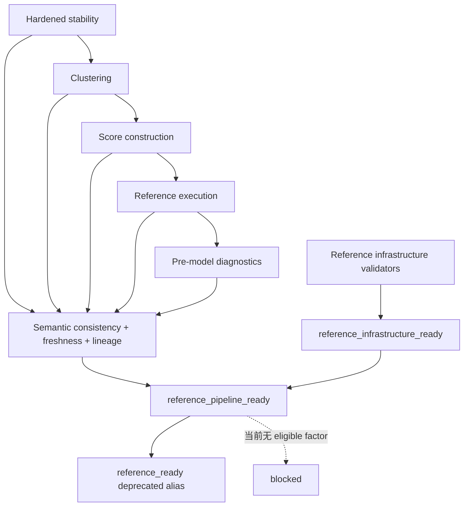

# Qlib A股因子验证框架 V1.1.1 Reference Pipeline Consistency Fix

> ARCHIVED / HISTORICAL：一致性修复阶段已完成。

> 文档状态：实施完成，等待 PR CI 最终确认
> 制定日期：2026-07-13  
> 适用分支：`agent/factor-validation-roadmap-v1`  
> 适用 PR：Draft PR #1  
> 前置计划：[FACTOR_VALIDATION_HARDENING_V1_1.md](./FACTOR_VALIDATION_HARDENING_V1_1.md)

> **实施结果（2026-07-13）：** V1.1.1 已按本计划完成。当前 `reference_infrastructure_ready=true`、`reference_pipeline_ready=false`、兼容字段 `reference_ready=false`；clustering representatives 和 score weights 均为 0，活动 score parquet 已移除，execution 与 pre-model diagnostics 已传播预期 blocker。reference lineage 的 4 个 critical issues 全部来自四个下游 blocked artifact status，没有 freshness、hash、未知 input 或 stale-upstream issue。本地 74 项测试和 11 个 synthetic validators 全部通过。

## 1. 任务定位

V1.1.1 是 V1.1 的一致性修复，不新增研究能力。它修复“上游稳定性已全部阻断、下游仍消费旧成功产物”造成的 readiness 假阳性，并把已有 Profile、manifest 和 lineage 设施升级为真正参与门禁的运行契约。

本轮冻结边界：

```text
不接入 Qlib Exchange
不启动任何模型训练
不运行 669 因子全量任务
不降低稳定性 coverage 或 eligible-window 阈值
不接入新因子源，不修改默认 candidate pool
不把 AKShare 当前快照回填为历史数据
不以重新附加 manifest 的方式把旧结果伪装为新结果
```

## 2. 审阅建议采纳结论

| 审阅建议 | 决策 | 计划中的调整 |
| --- | --- | --- |
| 拆分 infrastructure / pipeline readiness | 采纳 | `reference_ready` 在一个兼容周期内映射到 `reference_pipeline_ready`，不得再表示基础设施可用 |
| 模型门禁实际调用 `validate_lineage_chain()` | 采纳 | reference/full 两套参数均进入真实 gate，并输出结构化 issues |
| 校验 output hash、当前上游 ID 和 stale artifact | 采纳并加强 | manifest hash 改用输出目录相对路径；runtime 文件必须纳入；回填 manifest 不等于 freshness |
| 无 eligible factor 时清理旧聚类/score | 采纳 | 使用受控 staging + 原子发布；blocked 结果发布规范化空表，活动 runtime 不保留旧 parquet |
| score 过滤 selected/eligible 并排除零方向 | 采纳 | selection history 扩充 eligibility 字段；三个布尔条件同时满足才可加权 |
| execution / diagnostics 传播阻断 | 采纳 | 上游 blocked、空 score 或 freshness 失败时只发布 blocked contract，不执行旧结果 |
| 增加跨阶段集合一致性 contract | 采纳 | 新增独立 consistency audit、集合差异和计数守恒 |
| common-period NAV 归一化 | 采纳 | 区分 period growth、normalized NAV 与账户绝对 NAV，排名禁止使用后者 |
| 移除 `local_reference` 硬编码 | 采纳 | 所有实际消费路径来自 config；不强制加入 runner 尚未消费的无关字段 |
| untracked 源码参与 code-dirty | 采纳 | 只排除明确运行目录；未追踪源码、配置、测试和文档均令 dirty=true |
| full-research Profile 同质性加强 | 采纳 | 同时要求 `profile_type`、`profile_name` 和 `research_run_family_id` 一致 |
| 直接删除所有旧文件 | 调整后采纳 | 只处理阶段受控输出清单；先生成并验证 staging，再原子替换，避免半成品和越界删除 |
| blocked 阶段仍生成空 score parquet | 不采纳 | 活动 runtime 中不生成可被误消费的 parquet；用规范空 CSV、contract 和 manifest 表达 blocked |

## 3. 已复现的基线不一致

审计基于提交 `adf48b1` 的活动输出，结论如下：

| 检查 | 当前观察值 | 结论 |
| --- | ---: | --- |
| stability role | `holdout=10` | 没有可进入聚类的因子 |
| eligible window count | 全部 `0` | 所有窗口均不具备最终 eligibility |
| selection history | `120` 条且全部 `selected=False` | 当前 selection 不支持任何下游权重 |
| selection history schema | 缺少 `selection_eligible`、`eligible`、`eligibility_reason` | 下游无法完整复核窗口资格 |
| cluster representatives | 仍有 `3` 个旧候选 | stale active output |
| score weights | 仍给上述 `3` 个因子分配权重 | 违反选择语义 |
| composite scores | `2,819,616` 行，3 种方法 | 旧 runtime 仍处于可消费位置 |
| execution / diagnostics | 继续消费上述 score | 阻断未向下传播 |
| model readiness | `reference_ready=True` | 将模块可用与真实数据链可用混为一谈 |
| lineage gate | runner 未调用 `validate_lineage_chain()` | manifest 存在但没有形成真实门禁 |
| diagnostics path | 权重路径硬编码为 `local_reference` | full-research 配置不能安全复用 runner |

当前 manifests 的 input artifact ID 在形式上连成一条链，但 clustering、score 的 manifest 是通过迁移脚本附加到旧业务结果上的，不能证明这些结果由最新稳定性输入重新计算。因此：

```text
manifest adjacency != artifact freshness != semantic consistency
```

V1.1 的 `reference_ready=true` 从本计划生效起视为被审计推翻的旧结论，不得作为 PR 完成证据。

## 4. 目标状态与不变量

V1.1.1 在当前真实 reference 数据上的预期状态固定为：

```text
reference_infrastructure_ready = true
reference_pipeline_ready = false
reference_ready = false              # deprecated alias of pipeline readiness
full_research_ready = false
core_model_ready = false
liquidity_residualized_model_ready = false
historical_exposure_model_ready = false
model_training_started = false
```

核心不变量：

1. `reference_infrastructure_ready` 只证明代码、schema、合成 validator、Profile 和 manifest 设施可用。
2. `reference_pipeline_ready` 必须证明真实 stability → clustering → score → execution → pre-model diagnostics 链有效。
3. 没有合格因子是合法的研究结论，必须阻断真实 pipeline，不能通过降低阈值修复。
4. legacy Alpha158 / old-candidate baseline 可以独立展示，但不能替代当前 stability pipeline。
5. manifest、hash、freshness、semantic consistency 和 contract 必须全部通过，pipeline 才可 ready。
6. expected blocked 使用退出码 `2`；实现错误或 contract 违规使用退出码 `1`；成功使用 `0`。

## 5. 目标依赖关系



## 6. 输出与统一状态契约

新增输出：

```text
outputs/reference_pipeline_consistency_v1/current/
    inconsistency_inventory.csv
    stale_artifact_inventory.csv
    stage_consistency_status.csv
    unexpected_clustering_factors.csv
    unexpected_score_factors.csv
    unexpected_execution_methods.csv
    contract_status.csv
    artifact_manifest.json
    consistency_audit_report.md
```

所有阶段 contract 统一使用：

```text
status: pass | blocked | fail
artifact_status: pass | blocked | failed
blocked_reason: 机器可读原因码
severity: critical | capability | warning
```

至少冻结以下原因码：

```text
blocked_no_eligible_factors
blocked_insufficient_selected_components
blocked_no_valid_current_score
blocked_no_current_reference_pipeline
blocked_stale_upstream_artifact
blocked_manifest_output_mismatch
blocked_semantic_consistency
```

## 7. 分步实施计划

### WP0：冻结不一致证据

目标：修改 runner 前保存可复核的现状证据。

动作：

1. 新增 `configs/reference_pipeline_consistency_v1.yaml` 与 `scripts/audit_reference_pipeline_consistency_v1.py`，所有活动输入路径由配置提供。
2. 读取 stability、selection、representatives、weights、score、execution、diagnostics 和 readiness。
3. 生成 inconsistency / stale inventory 与审计报告。
4. 只读审计不得刷新、迁移或重写任何上游 manifest。

验收：报告明确记录 10 holdout、0 eligible windows、120 条未选择记录、3 个 stale representatives 和旧 score runtime。

### WP1：Manifest v2 与输出 freshness

目标：让 manifest 能证明“当前活动文件确实是该 artifact 的输出”。

预计文件：

```text
research_validation/lineage.py
tests/test_artifact_lineage.py
tests/test_artifact_freshness.py
```

动作：

1. 将 `output_file_hashes` 的 key 从 basename 改为相对 output directory 的路径，避免 runtime 文件和同名文件碰撞。
2. runtime parquet、CSV、JSON、报告和受控 runtime 文件全部参与 hash。
3. 新增 `validate_manifest_outputs(manifest, output_dir, config)`：检查文件存在、SHA256、config hash、受控输出集合。
4. manifest v2 增加 `artifact_status`、`blocked_reason`、`research_run_family_id` 和 `producer_run_id`。
5. 保留 manifest v1 只读兼容，但 v1 不得通过新的 pipeline freshness gate。
6. `migrate_reference_lineage_v1.py` 只允许标记 `legacy_output_pre_lineage`，不得产生 `fresh=true`。

验收：修改 score parquet 一个字节、替换 config 或遗漏 runtime 文件均会产生 critical issue。

### WP2：真实 Lineage Chain 门禁

目标：模型 gate 和 consistency gate 必须实际调用 lineage validator。

动作：

1. reference gate 调用：

   ```python
   validate_lineage_chain(
       manifests,
       profile_gate="reference",
       require_complete=False,
       require_known_inputs=True,
       require_consistent_ids=True,
       require_clean_code=False,
   )
   ```

2. full-research gate 使用 `require_complete=True`、`require_clean_code=True`。
3. 对每个 stage 建立“当前 manifest 唯一映射”，校验下游 input ID 等于磁盘上当前上游 artifact ID。
4. 检查未知 input、重复 stage、DAG cycle、日期范围、universe/split/catalog/frame ID 和 output freshness。
5. 输出 `lineage_issues.csv` 与 `lineage_validation_summary.csv`，字段至少包括 check、artifact、stage、severity、reason。
6. 任一 critical reference issue 令 `reference_pipeline_ready=false`。

验收：重新运行 stability 后不运行 clustering，clustering 及全部下游自动 stale。

### WP3：受控输出发布协议

目标：blocked 或失败运行不遗留上一次成功 runtime。

动作：

1. 每个 runner 定义自己的 `CONTROLLED_OUTPUTS`，禁止目录级模糊删除。
2. 在同一文件系统的 staging 目录生成完整结果。
3. staging 通过 schema、contract 和 manifest 自校验后，再替换活动输出。
4. blocked 也是可发布结果：发布 contract、manifest、报告和规范空表；不发布可被下游消费的 runtime parquet。
5. failed 不替换活动目录，并明确标记临时运行失败；不得留下部分新、部分旧的混合状态。
6. 旧业务产物的历史证据由 Git 历史保存，不继续留在活动路径冒充当前结果。

验收：连续执行“成功 → blocked”后，活动目录只包含 blocked run 的受控输出。

### WP4：稳定性选择历史 schema

目标：让下游能复核 selection 与最终 eligibility。

动作：

1. `factor_selection_history.csv` 增加：

   ```text
   selection_eligible
   eligible
   eligibility_reason
   ```

2. 保留 train/validation selection 与 test evaluation 的无泄漏边界。
3. 冻结现有 0.80 coverage、有效 IC 数和 3 eligible windows 阈值。
4. contract 明确输出 selected、eligible 和 eligible-role factor counts。

验收：当前真实输入仍为 10 holdout、0 eligible factors；不得为下游恢复旧候选。

### WP5：Clustering 的零输入行为

目标：无 eligible factor 时输出诚实的 blocked artifact。

动作：

1. clustering 输入集合严格来自稳定性允许角色且 `eligible_window_count` 达标。
2. 输入为 0 时不调用相关矩阵、距离或层次聚类算法。
3. 发布带完整列 schema 的空 clusters、representatives、excluded 文件。
4. correlation matrices 不保留旧内容；按受控协议发布空 schema 或不发布，并由 manifest 明确记录。
5. contract 输出 `eligible_factor_count=0` 和 `blocked_no_eligible_factors`，退出码为 `2`。

验收：活动 `cluster_representatives.csv` 不再含旧 3 个候选。

### WP6：Score 的选择、方向与组件门禁

目标：任何未选择、未 eligible 或零方向因子都不能进入权重。

动作：

1. representatives 与 history 合并后同时过滤：

   ```python
   selected == True
   selection_eligible == True
   eligible == True
   frozen_direction in {-1, +1}
   ```

2. 删除 `replace(0, 1)`；零方向记录为 `excluded_zero_direction`。
3. 每个 split/method 在生成 score 前检查 `minimum_components`。
4. 无有效窗口时发布空 weights / diagnostics / method availability，contract 为 `blocked_insufficient_selected_components`。
5. blocked 活动目录不得存在 `runtime/composite_scores.parquet`。
6. factor weight 集合必须是 selected representatives 的子集。

验收：当前真实 reference score stage blocked，旧 2,819,616 行 parquet 不再处于活动消费路径。

### WP7：Execution 与 diagnostics 阻断传播

目标：下游不能绕过 score contract 或使用 stale runtime。

动作：

1. execution 启动前校验当前 score contract、manifest、freshness、非空数据和 minimum-component policy。
2. 任一失败时发布 `blocked_no_valid_current_score`，不执行订单，不保留旧成交/NAV/runtime。
3. pre-model diagnostics 分别报告：

   ```text
   legacy_baselines_available
   current_stability_pipeline_available
   ```

4. legacy baselines 只能作为独立展示；不能补齐或替代 stable/cluster/stability methods。
5. current pipeline 不可用时发布 `blocked_no_current_reference_pipeline`，不生成可用于排名的 current-method comparison。

验收：当前 execution 和 pre-model diagnostics 均按预期 blocked；legacy 对照仍可单独读取。

### WP8：跨阶段 Semantic Consistency Contract

目标：在 lineage 之外验证业务集合关系。

至少检查：

```text
stability_selected_factor_count
stability_eligible_factor_count
clustering_input_factor_count
cluster_representative_count
score_weight_factor_count
score_valid_factor_count
execution_score_method_count
diagnostic_current_method_count
```

集合约束：

```text
clustering factors ⊆ stability eligible factors
representatives ⊆ clustering factors
score factors ⊆ selected eligible representatives
execution current methods ⊆ valid current score methods
diagnostic current methods ⊆ current execution methods
```

任一集合差异、计数倒挂或 stale stage 产生 critical contract issue。

### WP9：Readiness 语义拆分

目标：基础设施成功不再使真实 reference 数据链误报 ready。

输出字段：

```text
reference_infrastructure_ready
reference_pipeline_ready
reference_ready
reference_ready_deprecated
reference_lineage_valid
full_research_lineage_valid
lineage_issue_count
critical_lineage_issue_count
full_research_ready
core_model_ready
liquidity_residualized_model_ready
historical_exposure_model_ready
model_training_started
```

规则：

```text
reference_ready = reference_pipeline_ready
reference_pipeline_ready = infrastructure ready
                           AND lineage/freshness valid
                           AND semantic consistency pass
                           AND stability→diagnostics contracts pass
```

兼容字段保留一个版本并标记 deprecated；所有文档和 PR 使用两个新字段。

### WP10：Diagnostics、配置与代码状态细化

#### Common-period NAV

`performance_summary` 增加：

```text
period_growth = product(1 + daily_return)
normalized_final_nav = period_growth
account_ending_nav = 原账户最后 NAV
```

common-period 排名只能使用归一化收益、IR、回撤和 period growth，禁止使用账户绝对 NAV。

#### 路径配置化

1. 将 diagnostics 中硬编码的 reference weights 改为 `factor_weights` 配置。
2. 所有实际消费的 score、weights、factor frame、input manifests 和 output dir 均来自当前 config。
3. 只有 runner 确实使用 tradability 数据时才增加 `tradability_frame`，不添加无效配置字段。
4. 新增静态测试，关键 runner 不得包含活动下游的固定 `local_reference` 路径。

#### Code dirty

1. `capture_code_state()` 检查未追踪文件。
2. 只排除 `outputs/`、`tmp/` 和明确缓存目录。
3. 未追踪 `.py/.yaml/.yml/.json/.md`、测试和 CI 文件均令 dirty=true。
4. 仅新增受排除运行产物不令 dirty=true。

#### Full profile homogeneity

full-research chain 同时要求：

```text
profile_type == full_research
profile_name 唯一
research_run_family_id 唯一
universe/split/catalog/frame IDs 一致
```

### WP11：测试、validator、文档与 PR

新增或扩展测试至少覆盖：

- 全 holdout 时 clustering blocked；
- selected/eligible 为 false 时不得进入 weights；
- frozen direction 0 不得变为 +1；
- stale representative、旧 parquet 和 hash mismatch 被阻断；
- gate 实际调用 lineage validator，未知 input 和旧上游 ID 被阻断；
- infrastructure pass 但 pipeline blocked；
- 不同 full profile name/run family 被阻断；
- common-period normalized NAV 不受区间前账户 NAV 影响；
- blocked run 不保留旧 runtime；
- 规范空输出通过 schema；
- runner 不硬编码 reference 权重路径。

新增：

```text
scripts/validate_reference_pipeline_consistency_v1.py
```

CI validator 从 10 个增加到 11 个。validator 必须构造并成功阻断：全 holdout + 旧 reps、selected false score、stale input ID、parquet hash mismatch、infrastructure ready/pipeline blocked。

## 8. 推荐提交顺序

```text
1. document and audit reference inconsistency
2. enforce artifact freshness and active lineage validation
3. add transactional stage output publishing
4. block stale clustering and score artifacts
5. propagate empty-selection blockers downstream
6. split infrastructure and pipeline readiness
7. normalize common-period nav and remove hardcoded paths
8. add consistency validators and finalize documentation
```

每个提交必须可独立回滚，并在提交后运行相关单元测试。不得把阈值变更与 freshness 修复混在同一提交。

## 9. 验证顺序

```powershell
$python = 'E:\anaconda_envs\qlib_env\python.exe'

& $python scripts\audit_reference_pipeline_consistency_v1.py
& $python -m pytest tests\test_artifact_lineage.py tests\test_artifact_freshness.py -q
& $python -m pytest tests\test_rolling_evaluation.py tests\test_factor_clustering.py tests\test_score_construction.py -q
& $python -m pytest tests\test_trade_constraints.py tests\test_method_comparison_contract.py tests\test_model_readiness.py -q
& $python scripts\validate_reference_pipeline_consistency_v1.py
& $python -m pytest -q
```

随后运行全部 11 个 synthetic validators，并检查：

```powershell
git diff --check
git status --short
gh pr checks 1
```

预期 blocked runner 的退出码 `2` 必须由验收脚本显式识别，不能被当成实现失败，也不能为了 CI 方便改为 pass。

## 10. Definition of Done

V1.1.1 只有同时满足以下条件才完成：

1. 冻结审计输出已记录当前跨阶段不一致；
2. 新 stability 全 holdout 时，活动 clustering 不再含旧 3 个代表因子；
3. selected/selection-eligible/eligible 任一为 false 的因子不能进入 score；
4. 零方向因子不会被强制转成正方向；
5. blocked score 活动路径不保留旧 runtime parquet；
6. execution 和 pre-model diagnostics 正确传播 current pipeline blocker；
7. lineage validator、output freshness 和当前上游 ID 校验真实进入 readiness gate；
8. semantic consistency 的集合与计数关系全部可审计；
9. `reference_infrastructure_ready=true` 且当前 `reference_pipeline_ready=false`；
10. deprecated `reference_ready` 不再产生假阳性；
11. common-period NAV 使用归一化指标；
12. full-research runner 不硬编码 reference 下游路径；
13. untracked 源码/配置能触发 code dirty；
14. full-research profile name 与 run family 同质；
15. 原有 60 项测试和新增测试全部通过，11 个 validators 全部通过；
16. PR #1 保持 Draft，CI 通过，工作树干净；
17. 本轮未接入 Qlib Exchange、未训练模型、未运行 669 因子；
18. 下一 PR 仍只处理 Qlib Exchange integration。

## 11. 实施完成后的交付摘要

实施结束时必须报告：

```text
修复问题与修改文件
新增测试与 validator
stale artifact 处理结果
最新 readiness summary
lineage/freshness/semantic issue summary
本地测试与 CI 结果
最新提交 SHA
下一 PR 建议范围
```

### 11.1 实际交付状态

```text
reference_infrastructure_ready = true
reference_pipeline_ready = false
reference_ready = false
full_research_ready = false
core_model_ready = false
liquidity_residualized_model_ready = false
historical_exposure_model_ready = false
model_training_started = false

active cluster representatives = 0
active score weight factors = 0
active composite_scores.parquet = absent
active execution daily rows = 0
active pre-model comparison rows = 0
stale downstream stage count = 0
reference lineage issues = 4 expected blocked artifact statuses
pytest = 74 passed
synthetic validators = 11 passed
```
