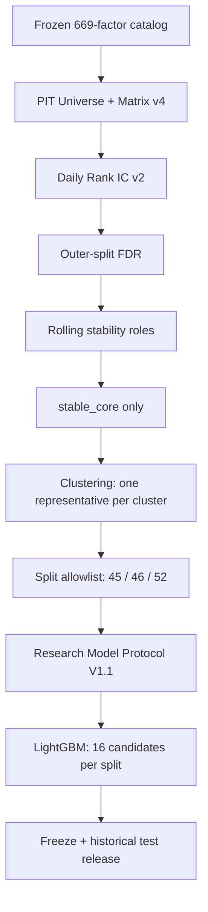
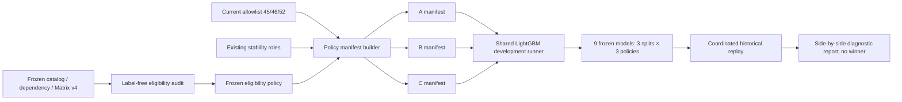

# ML Feature Pool Policy MVP V1 实施计划

> 状态：**MVP V1 COMPLETE / DIAGNOSTIC ONLY**
>
> 计划日期：2026-08-14
>
> 研究类别：`post_observation_research`
>
> 实验范围：A/B/C 三个并列 historical diagnostic arms
>
> 不影响：Frozen Strategy V1、52 特征顺序、Forward evidence、历史 outputs/artifacts

> 完成日期：2026-08-15
>
> 结果入口：[`reports/ml_feature_pool_mvp_v1/REPORT.md`](../../../reports/ml_feature_pool_mvp_v1/REPORT.md)
>
> 完成范围：feature-only audit 与阈值冻结、9 个 development arms、9 个 pre-test
> freezes、一次性 9-arm historical replay、固定 P01 的 0/10/20 bps 并列诊断。
> 全部结果固定 `decision_authority=diagnostic_only`、`selection_authorized=false`、
> `strategy_v2_authorized=false`；未产生 policy winner。

## 1. MVP V1 的唯一研究问题

MVP V1 只回答：

> 在标签、股票池、时间切分、预处理、LightGBM 候选表和组合协议保持一致时，当前
> strict feature pool、加入既有 `conditional_signal` 的 pool、以及仅受数据资格约束
> 的 broad pool，在历史样本外时期呈现什么差异？

本阶段是三组**并列诊断实验**，不是 policy selection。A/B/C 各自在自己的
development 数据上、使用完全相同的 LightGBM candidate table 选择模型；三个 policy
随后全部冻结并统一执行 historical replay。MVP V1 不产生 `winner`、`leader`、
`selected_policy` 或 Strategy V2 决策。

## 2. 本次范围锁定

### 2.1 必须实现

1. Policy A：`strict_current_baseline`；
2. Policy B：`current_plus_existing_conditional_signal`；
3. Policy C：`broad_data_qualified`；
4. 完全 label-free、development-feature-only 的 eligibility audit；
5. audit 完成后再确定并冻结 missing-rate、finite-days、finite-samples 阈值；
6. 三个 policy 使用同一 16-row LightGBM candidate table，各自独立选模；
7. 每个 `outer split × policy` final fit、freeze 和一次性 historical replay；
8. prediction、model/resource、固定 P01 portfolio 三层并列比较；
9. 保留当前 Factor Research、clustering、Strategy V1 和所有历史产物。

### 2.2 明确延期

以下内容不进入 MVP V1：

- A/B/C 之间的 policy winner selection；
- development policy ranking 或自动推荐；
- clustering ablation、每簇多代表实验或 group-aware selection；
- SHAP、permutation importance、feature ablation、group ablation；
- pairwise interaction 或 interaction strength search；
- bootstrap 显著性/置信区间；
- feature-importance stability、importance rank stability；
- Elastic Net/group regularization 或其他 model-aware feature selection；
- 新因子、新标签、新 universe 或新 LightGBM 参数空间；
- Strategy V1 替换或 Strategy V2 上线判断。

这些项目只能在 MVP V1 结果完成后，以新阶段和新计划进入。

## 3. 当前工程事实与复用边界

### 3.1 当前真实数据流



Matrix v4 已物化 669 个因子：Alpha158 155、Alpha360 358、Alpha101 64、TA 77、
Project Basic 15。当前 role 和 LightGBM 输入规模为：

| Outer split | stable_core | conditional_signal | monitor | factor-research holdout | 当前 ML 特征 |
|---|---:|---:|---:|---:|---:|
| split_001 | 460 | 58 | 0 | 151 | 45 |
| split_002 | 238 | 270 | 4 | 157 | 46 |
| split_003 | 214 | 354 | 2 | 99 | 52 |

当前系统存在两个串联硬门槛：

1. 单因子 IC/FDR/方向/rolling stability 决定是否成为 `stable_core`；
2. clustering 再把数百个 `stable_core` 压缩为每簇一个 representative。

MVP V1 不修改这条历史链，只在模型输入层旁路构造 B/C。

### 3.2 必须原样复用

- `full_research_factor_catalog_669_v1` 与 `factor_dependency_v1`；
- Point-in-Time Universe v2、Matrix v4、Labels v2；
- 现有 outer date assignments、purge、embargo 和 development folds；
- 当前 `factor_rolling_stability_v2` role 输出；
- 当前 clustering 输出作为 annotation；
- Research Model Protocol V1.1 的 target transform、preprocessing 和访问边界；
- `research_lightgbm_v1.yaml` 的 4 structural rows × 4 checkpoints；
- deterministic seed/thread/environment 约束；
- pre-test freeze、test loader 和 single-release 机制；
- Historical Portfolio Backtest V1 的 P01、市场语义和执行引擎。

### 3.3 不能改写

- `outputs/full_research_feature_matrix_v4/current` 及 runtime partitions；
- `outputs/full_research_labels_v2/current` 和 `labels_v2.parquet`；
- `outputs/factor_multiple_testing_v2/current`；
- `outputs/factor_rolling_stability_v2/current`；
- `outputs/factor_clustering_v2/current`；
- `outputs/split_specific_allowlist_v2/current`；
- `outputs/research_selection_lineage_closure_v1/current`；
- `outputs/research_model_protocol_v1_1/current`；
- `outputs/research_lightgbm_v1/development` 和 `current`；
- `outputs/historical_portfolio_backtest_v1/current`；
- `artifacts/prospective_forward_candidate_v1/sha256/`；
- `outputs/forward/**` official evidence；
- Strategy V1 的 52 特征、模型、预处理、Top50 和 5 日调仓规则。

## 4. MVP V1 架构



新增层只负责 ML feature pool，不改变 Factor Research 的角色含义。Clustering 在 B/C
manifest 中只保留 `cluster_id` annotation；MVP V1 不用它删除或限制特征，也不单独
检验 clustering 效应。

## 5. 三个 Policy 的精确定义

### 5.1 Policy A — `strict_current_baseline`

Policy A 直接使用当前冻结的 split-specific ordered feature list：

- split_001：45；
- split_002：46；
- split_003：52。

实现规则：

- 从 `research_selection_lineage_closure_v1/current` 适配；
- factor list、feature order、allowlist hash 必须与旧 artifact 完全一致；
- 不重算 role、clustering 或 representative；
- eligibility audit 若发现 A 中任一特征违反 correctness 级规则，整个实验 fail closed，
  不允许静默删除后继续称为 Policy A。

### 5.2 Policy B — `current_plus_existing_conditional_signal`

Policy B 定义为：

```text
Policy A exact members
+ 当前 factor_rolling_stability_v2 中该 split 的 existing conditional_signal
+ 通过已冻结 eligibility policy
```

Eligibility 前的规模上限：

| Split | A | existing conditional_signal | B 上限 |
|---|---:|---:|---:|
| split_001 | 45 | 58 | 103 |
| split_002 | 46 | 270 | 316 |
| split_003 | 52 | 354 | 406 |

实现规则：

- A 成员保留原顺序；
- 新增 conditional 按 `source_family, factor` canonical order 追加；
- 只使用已经存在的 `conditional_signal`，不在 MVP V1 中重新定义该角色；
- conditional 若未通过数据资格则排除并记录原因；
- 不加入 `monitor` 或 factor-research `holdout`；
- 不按 cluster 只留一个代表；
- 不新增 IC、FDR、方向或单调性阈值。

### 5.3 Policy C — `broad_data_qualified`

Policy C 定义为冻结 669 universe 中通过 eligibility policy 的全部变量。

以下项目只能作为 annotation，不能作为 C 的准入硬门槛：

- IC 或 Rank IC 大小；
- FDR pass/q-value；
- direction stability；
- monotonicity；
- `stable_core / conditional_signal / monitor / holdout` role；
- cluster membership 或 representative 状态。

Policy C 按 `source_family, factor` canonical order 排列。正常情况下应满足 `B ⊆ C`；
如果 A 成员导致该关系无法成立，应 fail closed 并审查历史 correctness，而不是修改 A。

## 6. Label-free Eligibility Audit 与阈值冻结

### 6.1 审计输入边界

Eligibility audit 只允许读取：

- 冻结 factor inventory；
- factor dependency inventory；
- Matrix v4 partition schema 和 development feature values；
- outer split 的 train/validation 日期定义，仅用于确定 development feature scope；
- PIT universe/key grid；
- factor inventory 中不含标签统计的 source/dependency metadata。

明确禁止读取或接收：

- Labels v2 或任何 label column/path；
- daily IC、validation Rank IC 或 model prediction metrics；
- stability role、FDR、clustering 等由标签统计派生的 metadata；
- outer-test feature values；
- outer-test labels、return、NAV 或 portfolio metrics。

实现上，eligibility audit API 不应包含 label 参数；访问审计必须同时证明：

```text
label_read_count = 0
test_feature_read_count = 0
test_label_read_count = 0
model_fit_count = 0
```

### 6.2 两步审计，不预写阈值

missing-rate、finite-days、finite-samples 的具体阈值在本计划中不预先写死。采用两个
明确阶段：

#### Audit A — feature profile

对每个 `outer_split_id × factor`，仅在 development feature scope 计算：

- total rows、finite rows、finite sample ratio；
- total dates、finite dates、finite date ratio；
- NaN/Inf count 和 missing rate；
- finite-value min/max/quantiles；
- train-only raw variance；
- imputation 后 weighted variance；
- exact duplicate group；
- source、dependency class；
- 预计 memmap/dataset 大小。

输出全量 feature profile、按 source/role 的分布、关键分位数和异常尾部清单。该阶段
只描述数据，不做 eligible/ineligible 判定。

#### Audit B — eligibility freeze

根据 Audit A 的 feature-only 分布形成并冻结：

- `maximum_missing_rate`；
- `minimum_finite_dates`；
- `minimum_finite_samples`；
- near-zero variance policy；
- exact-duplicate canonicalization policy；
- 规则版本、选择理由和 Audit A input hash。

阈值选择不得以目标 feature count、期望保留比例、Policy B/C 目标宽度或模型表现为
依据。允许的 authority 只有 `feature_data_quality`、`distribution_structure` 和
`resource_feasibility`；freeze 必须逐项记录 observed distribution、选择理由和所用
authority。资源不可行时优先改变所有 policy 共用的 execution mode 或报告 blocker，
不得为了凑出目标特征数而收紧 eligibility。

阈值冻结必须发生在任何 LightGBM fit、validation metric 或 historical replay 之前。
冻结后重新运行 Audit A 数据，生成 deterministic eligibility decision；MVP V1 后续不得
根据模型或 test 结果改变阈值。

建议把 Audit A 和 Audit B 作为两个独立命令/检查点：

```text
feature-only profile
→ review and freeze eligibility config
→ apply frozen eligibility config
→ build A/B/C manifests
→ only then allow model development
```

### 6.3 不依赖待确定阈值的 correctness 门槛

以下属于现有数据合同，不等待 Audit B 决定：

- factor 必须存在于冻结 669 inventory，且 enabled/runnable；
- dependency `review_status=proven`，不能为 unknown；
- Matrix partition 必须 pass，factor column 必须唯一存在；
- PIT key、日期和 feature-at-`t` 语义必须合法；
- 不能是全 development scope NaN/Inf；
- feature order/hash 必须唯一、连续、可复算。

其中任何 correctness failure 都应 fail closed。分布性阈值只决定 B/C 的数据资格，
不能掩盖数据合同错误。

Eligibility decisions 冻结之后，policy builder 才允许把既有 role/cluster metadata
追加为 annotation，或使用 existing `conditional_signal` 构造 B；这些 label-derived
metadata 不得进入 feature profile、阈值确定或 C 的资格判断。

Policy builder 必须先验证所有 Policy A 成员 correctness pass。只有在此前提下才允许
建立 `A ⊆ B ⊆ C`；若任一历史 A 成员暴露 schema、PIT、dependency、全量非有限值或
其他 correctness 问题，MVP V1 必须 fail closed，不能通过 grandfathering、删除或改名
绕过。

## 7. LightGBM Development 协议

### 7.1 候选表固定且三组相同

直接复用 `configs/research_lightgbm_v1.yaml`：

```text
4 structural rows × [100, 200, 400, 800] checkpoints
= 16 candidates per outer split per policy
```

所有 A/B/C 必须使用相同的：

- objective、trainer metric 和 boosting type；
- structural rows 和 checkpoint 集合；
- candidate ordering/hash algorithm；
- `early_stopping=False`；
- deterministic seed `20260725`；
- feature/bagging/data seeds；
- `num_threads=1` 和环境锁；
- validation metric 与 tie-break 顺序。

禁止因 B/C 特征更多而扩展或修改候选表。若资源不允许，MVP V1 应报告 resource
blocker，不能临时减少 C 的特征或只给某个 policy 换参数空间。

### 7.2 只做 policy 内模型选择

每个 `outer_split_id × policy_id` 独立执行当前 LightGBM development 流程：

1. 读取该 policy 的 frozen ordered features；
2. 读取相同 outer train/validation 日期；
3. preprocessing 只 fit outer train；
4. 16 candidates 在该 policy 的 validation predictions 上评价；
5. 按当前固定顺序选择该 policy 自己的 candidate：
   mean daily Rank IC → ICIR → coverage → lower complexity → canonical SHA；
6. 使用选中的 candidate 在 outer train+validation final refit；
7. 输出一个 policy-specific model 和 preprocessing freeze。

这一步是**模型内选参**，不是 A/B/C policy selection。MVP V1 不比较 development
metrics 来删除、晋级或选择某个 policy，三个 policy 无条件全部进入 freeze。

Policy B 在代码常量、配置、manifest、freeze、prediction receipt 和报告中始终使用
完整 ID `current_plus_existing_conditional_signal`。它只复用当前已存在的 Factor
Research role，不得被描述为新的 nested ML conditional selection。

### 7.3 逻辑并行、物理顺序运行

A/B/C 是并列实验臂，但为保证单线程确定性和控制内存，实际 full run 建议按固定顺序
串行执行：

```text
split_001: A → B → C
split_002: A → B → C
split_003: A → B → C
```

执行顺序不能影响 feature lists、candidate table、seed 或模型选择规则。每个 arm 单独
记录 runtime、peak RSS 和 disk；前一 arm 的运行结果不能改变后一 arm 的配置。

### 7.4 资源模式

Broad C 最高可达 669 特征，约 150～200 万 development rows。MVP V1 必须先运行
resource canary，估计：

- feature projection/spool 大小；
- float64 memmap 大小；
- LightGBM Dataset/binned data peak RSS；
- model runtime 和临时磁盘；
- A/B/C 是否能使用同一 execution dtype/mode。

若需要引入 float32 memmap 或 LightGBM binary dataset，必须：

1. 对 A/B/C 全部使用相同模式；
2. 先在 A canary 上与当前 float64 路径做数值等价验证；
3. 在 full model fit 前冻结 execution mode；
4. 不用 validation/test performance 决定资源模式。

## 8. Freeze 与 Historical Replay

### 8.1 Freeze 数量与内容

Development 完成后应产生精确 9 个 model freezes：

```text
3 outer splits × 3 policies = 9 freezes
```

每份 freeze 至少绑定：

- `outer_split_id`、`policy_id`；
- feature pool hash 和 feature-order hash；
- frozen eligibility policy hash；
- selected candidate 和 candidate-table hash；
- fitted preprocessing artifact ID/hash；
- model binary hash；
- training-data hash；
- train/validation date hash；
- target transform、metric registry、seed、environment 和 code commit；
- exact test-date hash；
- `test_read_count_before_freeze=0`；
- historical evidence disclosure。

不存在 `selected_policy` 字段。三个 policy 的 freeze status 权限完全相同。

### 8.2 协调式一次性 replay

在 9 个 freezes 全部 pass 后，使用一个协调式 release 命令读取历史 test：

1. 第一次 test read 前验证 9 个 freezes 完整、代码/输入 hashes 有效；
2. 对所有 `split × policy` 生成 prediction；
3. 使用完全相同的 test rows、label 和 metric implementation；
4. 输出 9 组 prediction receipts、test metrics 和 daily IC；
5. release 完成后重复调用 fail closed；
6. 不允许只 release development 表现最好的一组；
7. 不允许 test 后重新 fit、改阈值、改 membership 或改 candidate。

当前 `split_001`～`split_003` 已经被观察，所以所有产物必须保持：

```text
experiment_class = post_observation_research
historical_test_already_observed = true
authoritative_execution = false
unbiased_final_estimate = false
production_model_selected = false
```

## 9. MVP V1 评价输出

MVP V1 只做并列描述和预先定义的差值表，不做统计 winner selection。

### 9.1 Prediction Layer

每个 `split × policy` 输出：

- mean daily Rank IC；
- daily Rank IC IR；
- positive IC day ratio；
- prediction coverage；
- daily IC count 和 pair-count coverage；
- development validation → historical test degradation；
- 相对 A 的逐 split absolute delta 和 relative delta。

汇总表可展示 equal-split mean、standard deviation、worst split 和正向 split 数，但不
运行 bootstrap、不生成 p-value/CI，也不根据这些指标产生 leader。

### 9.2 Model / Resource Layer

- feature count，按 source/role/cluster 的构成；
- selected LightGBM candidate；
- train/validation/final row count；
- validation metrics；
- wall time、peak RSS、runtime disk；
- model binary size、tree count和总 leaves；
- preprocessing/coverage failures；
- 是否有明显 validation → test degradation。

现有 LightGBM builtin feature importance 如因复用 runner 自然产生，可保留为
`diagnostic_only` 原始输出，但 MVP V1 不计算 importance stability、不据此筛选、不在
主结论中作 winner 依据。

### 9.3 Portfolio Layer

三个 policy 全部只使用已经冻结的 P01：

```text
Long Only Top50
equal weight
rebalance every 5 trading days
t+1 execution
```

固定并比较：

- gross return approximation、net return；
- annualized return、Sharpe；
- benchmark return、annualized excess、information ratio；
- max drawdown、Calmar；
- average/annualized turnover；
- commission、stamp tax、slippage、total cost、cost drag；
- fill rate、holding count、stale valuation limitation。

Primary 场景沿用当前 fee schedule 和 10 bps slippage。为满足成本敏感性，仅增加对所有
policy 完全相同的 0/20 bps slippage secondary diagnostics；不扫描 TopK、rebalance、
weighting 或其他组合参数。

### 9.4 报告措辞

最终报告可以陈述：

- B/C 在哪些 split 和哪些层面高于或低于 A；
- 增量是否跨 split 一致；
- prediction 改善是否转化为固定 P01 组合改善；
- 更宽 pool 带来的资源和 degradation 成本；
- 结果是偏向 strict、偏向 broader，还是 mixed。

但不得输出机器可执行的 `winner`、`selected_policy` 或 Strategy V2 candidate。任何
后续 policy selection 必须在新阶段预注册规则，并需要新的 prospective evidence。
若人类可读报告使用 `strict_favored`、`broader_favored` 或 `mixed` 描述历史方向，
同一记录必须固定 `decision_authority=diagnostic_only`，且不得被任何自动流程当成
winner、模型发布门禁或 Strategy V2 授权。

## 10. 建议新增或修改的代码

### 10.1 新增

| 文件 | MVP 职责 |
|---|---|
| `configs/ml_feature_pool_mvp_v1.yaml` | 三个 policy、共同 candidate 引用、splits、metrics、resources |
| `configs/ml_feature_eligibility_mvp_v1.yaml` | Audit B 后冻结的阈值与规则；Audit A 前不得填数值 |
| `model_research/feature_eligibility.py` | label-free profile 和 frozen eligibility 应用 |
| `model_research/feature_pool_policy.py` | A/B/C ordered manifest 与 hash |
| `model_research/feature_pool_experiment.py` | policy-aware development、final fit、freeze、coordinated replay |
| `model_research/feature_pool_comparison.py` | 三层并列描述表；无 winner logic |
| `scripts/audit_ml_feature_eligibility_v1.py` | Audit A / Audit B 薄 CLI |
| `scripts/run_ml_feature_pool_mvp_v1.py` | canary/development/freeze/replay 薄 CLI |
| `tests/test_ml_feature_eligibility.py` | zero-label/test access、profile、threshold freeze |
| `tests/test_ml_feature_pool_policy.py` | A parity、B/C membership、order/hash |
| `tests/test_ml_feature_pool_experiment.py` | candidate equality、9 freezes、single release、no winner |

### 10.2 最小修改

- 在 `model_research/inputs.py` 增加 `load_split_feature_pool(...)`，不改变旧
  `load_split_feature_order(...)`；
- 复用或提取 `lightgbm_models.py` 的 candidate grid、preprocessing、spool、metrics
  和 final fit 纯逻辑，保证旧 `research_lightgbm_v1` 不变；
- 为新实验定义带 `policy_id`、`feature_pool_sha256` 的独立 prediction schema，不修改
  历史 V1 schema；
- 为历史执行增加只接收 frozen P01 的 policy wrapper，不修改旧 backtest outputs。

### 10.3 不新增

- factor registry/engine、feature store 或数据库；
- 新 PIT/universe/label/matrix 体系；
- policy manager、通用搜索器或第二套 lineage 平台；
- SHAP/permutation/interaction 模块；
- clustering/group selection 模块；
- winner selector 或 production gate。

## 11. 新产物

Runtime 输出使用独立、默认 ignored 的目录：

```text
outputs/ml_feature_pool_mvp_v1/
    eligibility_profile/
    eligibility_freeze/
    policy_manifests/
    canary/
    development/
    freezes/
    historical_replay/
    comparison/
    portfolio/
```

主要文件：

```text
feature_profile_by_split.csv
feature_profile_summary.csv
eligibility_freeze.json
feature_eligibility_decisions.csv
feature_pool_manifest.csv
policy_manifest.csv
validation_metrics.csv
selected_hyperparameters_by_policy.json
model_receipts.csv
preprocessing_receipts.csv
freeze_index.csv
test_metrics.csv
test_daily_ic.csv
prediction_comparison.csv
model_resource_comparison.csv
portfolio_comparison.csv
access_audit.csv
run_report.md
```

`feature_pool_manifest.csv` 至少包含：

```text
outer_split_id, policy_id, factor, feature_order,
source_family, factor_research_role, cluster_id,
baseline_member, eligibility_status, inclusion_reason,
feature_pool_sha256
```

`policy_manifest.csv` 每个 split/policy 一行，至少包含 feature count/order hash、
eligibility freeze hash、development date hash 和 parent artifact IDs。

完成后只把 compact 人类可读结论发布到：

```text
reports/ml_feature_pool_mvp_v1/
    REPORT.md
    policy_inventory.csv
    prediction_comparison.csv
    model_resource_comparison.csv
    portfolio_comparison.csv
    limitations.json
```

报告中不得存在 leader/winner machine artifact。

## 12. 具体实施顺序与门禁

### Phase 0 — Scope/config skeleton

1. 建立 MVP config skeleton；
2. 绑定 frozen 669 inventory、Matrix v4、roles、current allowlist、splits 和 LightGBM
   candidate table；
3. eligibility 三项数据分布阈值保持未设置；
4. 固定 no-winner、all-arms-freeze 和 historical disclosure。

退出标准：静态配置测试通过，任何 model command 因 eligibility 尚未冻结而被阻止。

### Phase 1 — Policy A adapter

1. 读取当前 45/46/52 ordered features；
2. 生成 A manifest；
3. 校验 legacy factor list、order hash、allowlist hash exact parity；
4. 确认旧 artifact 零修改。

退出标准：A 逐 split exact match。

### Phase 2 — Label-free Audit A

1. 构建 factor-to-partition index；
2. 只读取 development features；
3. 计算 669 × 3 split feature profiles；
4. 输出 missing/finite/variance/duplicate/resource 分布；
5. 输出访问审计，证明 label/test/model fit 全为零。

退出标准：feature profile 完整、可复算、无 label/test access。

### Phase 3 — Audit B eligibility freeze

1. 仅依据 Audit A 分布确定 missing-rate、finite-days、finite-samples 阈值；
2. 记录选择理由、输入 hash、规则版本；
3. 冻结 eligibility config；
4. 应用冻结规则生成 decision table；
5. 阻止任何后续阈值自动修改。

退出标准：eligibility freeze immutable，decision deterministic，仍无 label/model read。

### Phase 4 — A/B/C manifests

1. 生成 A；
2. 生成 A + existing conditional 的 B；
3. 生成 broad eligible C；
4. 校验 A exact parity、`A ⊆ B ⊆ C`；
5. 冻结 feature order 和 pool hash；
6. 生成 source/role/cluster inventory，但不按 cluster 筛选。

退出标准：3 splits × 3 policies 共 9 个 manifests 全部 pass。

### Phase 5 — Resource/model canary

依次运行：

```text
split_001 × A/B/C
× 20 train dates × 10 validation dates
× 2 structural rows × 100 rounds
```

然后对 C 执行 669-width resource canary。校验 deterministic hash、train-only
preprocessing、finite prediction、candidate equality、RSS/disk 和 zero test read。

退出标准：共同 execution mode 冻结，资源可接受；否则报告 blocker，不改变 pool。

### Phase 6 — Full development

固定物理顺序运行 9 个 arms。每个 arm：

1. 16 candidates 全部评价；
2. 按相同规则选择 arm 内 candidate；
3. validation mutation sensitivity pass；
4. outer train+validation final refit；
5. 输出 model/preprocessing receipts；
6. test reads 保持零。

退出标准：144 条 candidate metrics 完整（3 splits × 3 policies × 16），9 个 final
models 完成。不得生成跨 policy ranking。

### Phase 7 — Freeze

1. 校验 9 个 development arms；
2. 为每个 arm 绑定 policy/candidate/model/preprocessing/data/environment/code hashes；
3. 绑定 exact historical test dates；
4. 发布 9 个不可变 freezes；
5. 再次断言 test read=0。

退出标准：freeze index 恰好 9 行，无 `selected_policy`。

### Phase 8 — Coordinated historical replay

1. 一次性 release 全部 9 个 arms；
2. 输出 predictions、daily IC、test metrics 和 receipts；
3. 重复 release fail closed；
4. 不允许部分 release、test 后 refit或阈值变化。

退出标准：9/9 release 完成，historical disclosure 正确。

### Phase 9 — Fixed P01 and report

1. 每个 arm 运行相同 P01；
2. primary 10 bps，secondary 0/20 bps；
3. 生成 prediction/model-resource/portfolio 并列表；
4. 记录事实差异和 limitations；
5. 不生成 winner、推荐或 Strategy V2 决策。

退出标准：MVP report 能回答三组在历史上的差异，但保持诊断性质。

## 13. 测试清单

### 13.1 Eligibility

- audit API 无 label 参数；
- label path/column 出现在输入时 fail；
- development scope 之外的 feature read fail；
- Audit A 只输出 profile，不输出 eligibility；
- Audit B 未冻结时 model entry fail；
- threshold freeze 后 mutation fail；
- audit access counts 全为零；
- duplicate canonicalization 与输入行序无关。

### 13.2 Policy manifests

- A factor/order/hash 与 legacy exact match；
- B 新增成员均来自同 split 的 existing `conditional_signal` 且 eligible；
- C 只由 frozen 669 + eligibility 决定；
- C 不引用 IC/FDR/role/cluster 作为硬门槛；
- `A ⊆ B ⊆ C`；
- order 连续、唯一、deterministic；
- 9 个 pool hashes 唯一且可复算。

### 13.3 Model/freeze/replay

- A/B/C candidate table byte-equivalent；
- seeds、threads、environment 和 dates 相同；
- preprocessing 只 fit train；
- 每个 arm 16 candidates，合计 144；
- 每个 arm 只做 candidate selection，不调用 policy ranking；
- 9 个 models、9 个 freezes、9 个 releases；
- freeze 前 test feature/label read=0；
- release 前缺任一 arm 时整体 fail；
- repeated release fail closed；
- output schema 包含 policy/pool hash；
- codebase 中不存在 MVP winner/leader artifact；
- portfolio wrapper 只接受 frozen P01。

### 13.4 质量命令

```powershell
python scripts/check_quality.py fast
python -m pytest -q `
  tests/test_ml_feature_eligibility.py `
  tests/test_ml_feature_pool_policy.py `
  tests/test_ml_feature_pool_experiment.py
python scripts/check_quality.py full
```

若触及 Qlib execution，再运行：

```powershell
python scripts/check_quality.py qlib
```

完整模型训练不进入 CI；CI 只使用 synthetic/small fixtures 验证高风险语义。

## 14. MVP V1 验收标准

MVP V1 成功不要求 B/C 优于 A。成功标准为：

1. A/B/C 定义明确、split-specific、可复算；
2. Eligibility 阈值由 label-free Audit A 决定并在 model fit 前冻结；
3. A exact baseline 未变化；
4. 三个 policy 使用完全相同的 16-candidate table；
5. 各 policy 只在自身 development 数据上选择模型；
6. 9 个 models 全部冻结，未做跨 policy 选择；
7. freeze 前 test read=0，之后只做一次协调式 historical replay；
8. prediction、resource、P01 portfolio 可以并列比较；
9. 不产生 bootstrap、clustering ablation、SHAP/permutation 或 importance stability；
10. 不产生 winner/leader/selected-policy artifact；
11. 所有历史 artifacts 和 Strategy V1 evidence 未覆盖；
12. 报告诚实标记既有 test 已观察，不能作为 fresh unbiased OOS。

## 15. MVP V1 之后的明确分支

MVP V1 完成后仅形成下一阶段输入，不自动启动后续工作：

- 若需要判断 clustering 的独立影响，再设计 strict representatives vs all stable-core
  ablation；
- 若需要正式选 policy，再预注册 winner rule、uncertainty method 和 prospective
  confirmation；
- 若 broad 信息有稳定历史价值，再考虑 feature/group ablation、permutation、SHAP、
  interaction 或 regularization；
- 若要形成 Strategy V2，必须创建新的 freeze date，并从该日期之后积累 genuine
  forward evidence；
- Strategy V1 的历史预测、组合、持仓和 NAV 始终保留，不被 MVP V1 改写。
